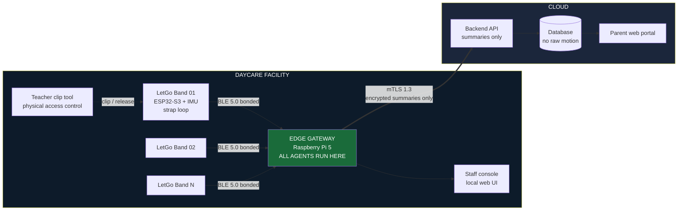
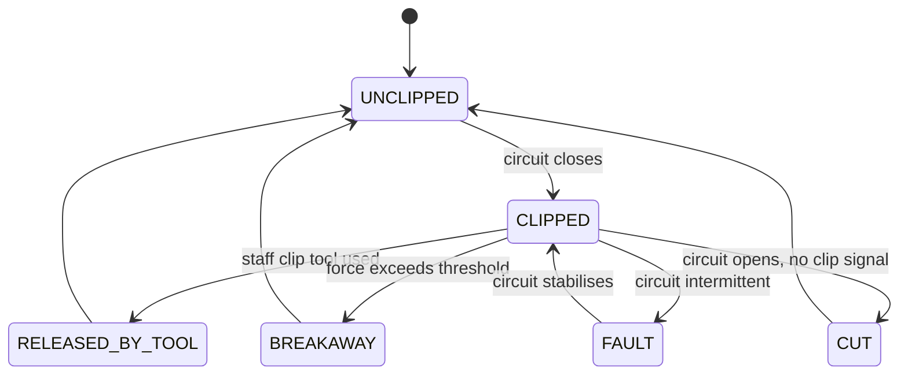
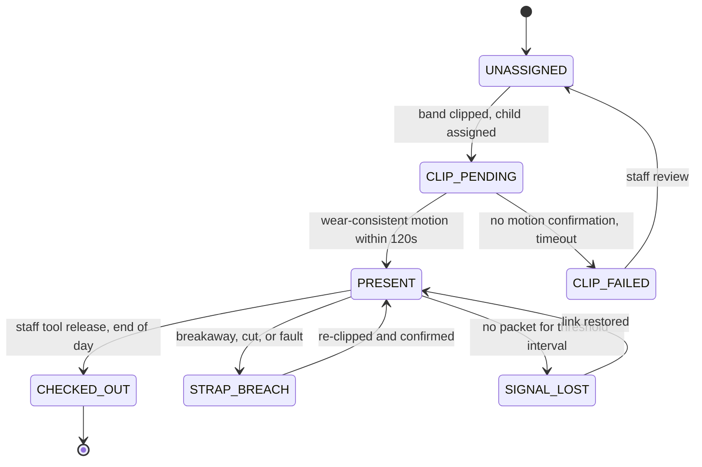
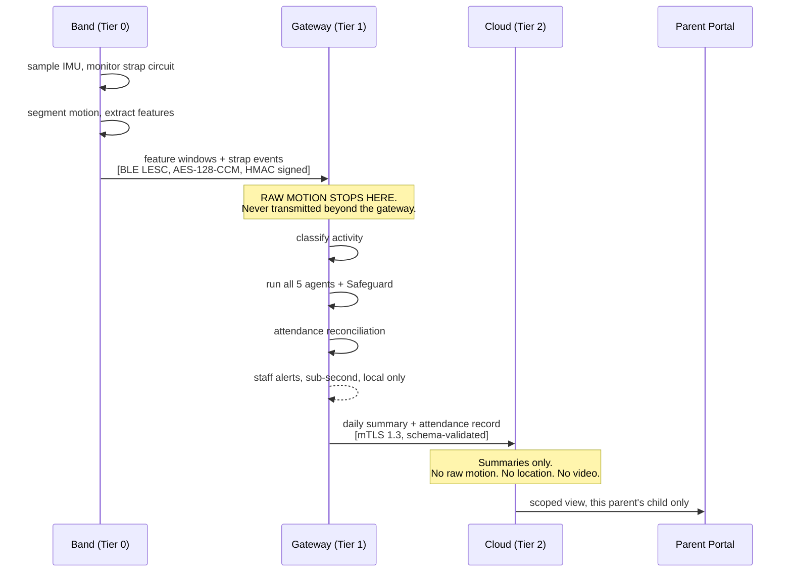
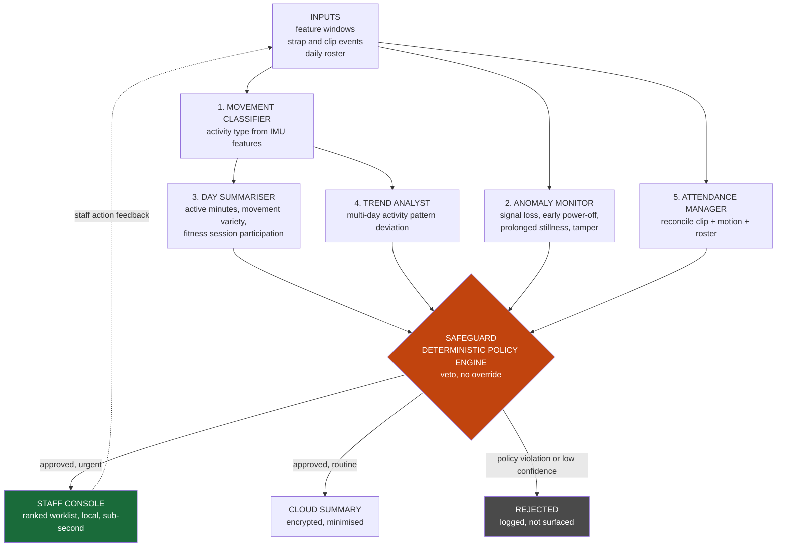

# LetGo Band

### An edge-first IoT and multi-agent ecosystem for daycare safety and child activity monitoring

**IEEE Computer Society R10 Summer School 2026 — Mini Ideathon**
**SDG Track: SDG 3, Good Health and Well-being**

---

## 1. The one-paragraph version

Daycare centres track attendance on paper and supervise children by line of sight. Staff-to-child ratios mean no adult can watch every child continuously, and parents receive no record of their child's day beyond a verbal handover. LetGo Band is a child-worn activity band with a tamper-evident strap, connected to a facility edge gateway that runs the entire agent workflow locally. Raw motion data never leaves the building. Only encrypted, minimised summaries reach the cloud, where parents view their child's day through a secure portal. The system automates attendance, detects safety anomalies in seconds, and gives parents an activity record that today does not exist.

---

## 2. Why this is SDG 3

| SDG 3 element | How the system addresses it |
|---|---|
| Healthy child development | Objective record of active minutes and movement variety, replacing no record at all |
| Injury and harm prevention | Second-level detection of device removal, tamper, prolonged stillness, and signal loss |
| Target 3.d, early warning and risk management | Anomaly agent produces graded escalations to staff rather than raw alarms |
| Continuity of care | Longer-term activity pattern deviations flagged for human review by staff |

We deliberately do not claim a second SDG track. Criterion 1 of the rubric rewards clear focus, and spreading across tracks reads as hedging.

**Explicit non-goals.** The system does not diagnose. It does not measure calories or body composition. It does not restrict a child's movement. It does not produce conclusions about a child; it produces flags for a human to review.

---

## 3. The problem, stated precisely

What daycare facilities do manually today:

1. **Attendance.** Paper register or a tablet form, signed by a parent at drop-off. Errors are common, and the register does not know if a child later leaves the premises.
2. **Supervision.** Line of sight. One carer covers a group. A child out of view is unmonitored.
3. **Activity records.** None. Parents get a verbal summary at pickup.
4. **Incident detection.** A carer notices, or nobody does.
5. **Pattern recognition.** A carer's memory across weeks, which does not survive staff turnover.

The failure is not carer negligence. It is the physical impossibility of continuous individual attention at legally permitted staffing ratios. That framing matters for the pitch: the system does work that was never humanly possible, rather than replacing work humans do badly.

---

## 4. System architecture

### 4.1 Physical topology



**The single most important line on this diagram is the one leaving the building.** Everything to the left of it is raw data. Everything to the right is a summary. The agents sit on the left.

### 4.2 Three-tier computation split

| Tier | Where | What runs here | Why here |
|---|---|---|---|
| **Tier 0** | Band | Sampling, filtering, strap circuit monitoring, step and motion segmentation, feature extraction, local buffer | Must work with the gateway out of range. Strap events must be instant. |
| **Tier 1** | Edge gateway | Movement classification model, all five agents, the deterministic Safeguard, attendance reconciliation, staff console, local storage of raw features | Raw child motion must not leave the premises. Latency for safety alerts must be sub-second. Facility must keep working with no internet. |
| **Tier 2** | Cloud | Parent portal, encrypted daily summaries, multi-site administration, long-horizon storage of summaries only | Parents are off-site. Nothing here is safety-critical. |

**Design rule, stated once and enforced everywhere:** no safety decision depends on Tier 2. If the internet fails, the facility loses the parent portal and loses nothing else.

---

## 5. The band

### 5.1 Hardware

| Component | Purpose |
|---|---|
| ESP32-S3 | MCU, BLE 5.0, on-device feature extraction, secure element for key storage |
| 6-axis IMU | Accelerometer and gyroscope for activity classification and wear-consistency |
| Conductive strap loop | Continuous circuit through the band. Closed means worn. |
| Safety clip | Requires the teacher's tool for normal release |
| Calibrated breakaway | Mechanical separation at a specified force, typically 20 to 30 N |
| LiPo cell | Multi-day operation, charged in a contactless dock |
| No external buttons | Nothing a child can press. Provisioning happens in the dock. |

### 5.2 The strap loop is the key engineering idea

A conductive loop through the strap is a closed circuit monitored by a GPIO pin. This gives deterministic ground truth where every other wearable has to guess.

Most wearables cannot distinguish "the person is still" from "the device came off." LetGo Band does not have to infer it. The circuit knows.



Four failure modes, distinguished from two signals. `BREAKAWAY` and `CUT` are the highest-priority message class in the system and bypass normal batching.

### 5.3 Child safety: why the band must be removable

A band a child cannot remove at all is an entrapment and ligature risk, and it makes mass evacuation impossible. The design uses **two-stage release**:

1. **Normal release** requires the teacher's clip tool. Childproof by design.
2. **Emergency release** is a calibrated mechanical breakaway. If the band snags on playground equipment or a child pulls hard enough to injure themselves, it separates.

**Security is preserved because detection replaces retention.** The strap circuit registers the breakaway in the same instant it happens. The system does not depend on the band staying on to know where a child is. It depends on knowing the moment it comes off.

This is also the answer to the hardest question in Q&A: the band cannot trap a child, and it cannot be removed without the system knowing within a second.

---

## 6. Attendance, and why it needs two signals

A band clipped around a chair leg or a bag strap also closes the circuit. Clip state alone is not attendance.

**Attendance requires two independent conditions:** circuit closed, plus wear-consistent motion within a defined window.



The Attendance Manager agent reconciles three independent sources: clip events, motion confirmation, and the expected roster for the day. Its output is not a register entry, it is the set of mismatches between those three.

---

## 7. Connectivity and encryption

### 7.1 Link layer: band to gateway

| Property | Choice | Reason |
|---|---|---|
| Transport | BLE 5.0, connection-oriented | Low power, dense device support, mature stack |
| Pairing | LE Secure Connections with bonding | ECDH key agreement, resists passive eavesdropping |
| Key storage | ESP32-S3 secure element, per-device keys | No shared secrets. Compromising one band compromises one band. |
| Identity | Resolvable Private Addresses, rotating | A parked attacker cannot track a specific child by MAC address |
| Payload | AES-128-CCM at link layer | Standard BLE encryption, plus application-layer signing below |
| Integrity | HMAC over each packet with a per-device key | Gateway rejects any packet it cannot authenticate |
| Provisioning | Contactless dock only, never over the air | No field pairing means no pairing attack surface |

**Rotating private addresses matters more than it sounds.** Without it, anyone within BLE range of the facility could passively log which child arrived when, from the street, with a phone. This is a real privacy attack on children and almost no student project accounts for it.

### 7.2 Gateway to cloud

| Property | Choice |
|---|---|
| Transport | HTTPS or MQTT over TLS 1.3 |
| Authentication | Mutual TLS with a per-gateway client certificate |
| Certificate lifecycle | Short-lived, automatically rotated, revocable per facility |
| Payload | Summaries only. Schema-validated and rejected if it contains disallowed fields. |
| Buffering | Store and forward on the gateway. Nothing is lost during an outage. |
| Replay protection | Monotonic sequence number and timestamp per gateway |

### 7.3 End-to-end data flow, with what is dropped at each hop



### 7.4 What is stored where

| Data class | Band | Gateway | Cloud |
|---|---|---|---|
| Raw IMU samples | Rolling buffer, hours | Retained locally, short window | **Never** |
| Extracted features | Transient | Yes, retention set by facility | **Never** |
| Activity classifications | No | Yes | Aggregated daily only |
| Strap and clip events | Yes | Yes | Attendance record only |
| Attendance record | No | Yes | Yes |
| Daily summary | No | Yes | Yes |
| Anomaly flags | No | Yes | Only if escalated and resolved |
| Trend flags | No | Yes, staff-reviewed | **Never sent unreviewed** |

---

## 8. Agent orchestration

All agents execute on the edge gateway. This is both the privacy architecture and the availability architecture.



### 8.1 Agent contracts

Each agent has an explicit may-not clause. These go verbatim into `CLAUDE.md`.

**1. Movement Classifier**
Consumes feature windows. Produces activity classifications with confidence scores.
*May not:* interpret clinically, make recommendations, or output anything about a child's development.

**2. Anomaly Monitor**
Consumes strap events, link state, and motion. Produces graded anomaly events: signal loss after check-in, early device power-off, prolonged stillness inconsistent with wear, strap breach.
*May not:* suppress a strap breach event under any circumstance. Breaches always escalate.

**3. Day Summariser**
Consumes classifications across a session. Produces active minutes, movement variety, and fitness session participation.
*May not:* produce calorie, weight, body composition, or fitness-scoring output. Never compares one child to another.

**4. Trend Analyst**
Consumes multi-day summaries. Produces activity pattern deviation flags.
*May not:* produce a conclusion, diagnosis, or characterisation of a child. Output is a flag for staff review only, never surfaced to parents unreviewed.

**5. Attendance Manager**
Consumes clip events, motion confirmation, and the roster. Produces attendance state transitions and reconciliation mismatches.
*May not:* mark a child present on clip state alone.

**Safeguard, deterministic, not an agent**
Rules only. No model. Holds: who may see which child's data, what escalates to staff versus what goes to parents, the confidence floor below which nothing is surfaced, and the contraindication list for the Trend Analyst. Has veto power and no override path.

### 8.2 Failure paths, which is where the design marks are

| Condition | System behaviour |
|---|---|
| Gateway unreachable from band | Band buffers locally, continues strap monitoring, replays on reconnect |
| Internet down | Facility fully operational. Parent portal stale. No safety function lost. |
| Classifier confidence below floor | Safeguard suppresses. Logged, not surfaced. Never guessed. |
| Strap breach | Highest priority. Bypasses batching. Escalates immediately regardless of any other agent state. |
| Conflicting agent outputs | Safeguard precedence order applies. Safety outranks summary, always. |
| Band battery critical | Escalates to staff before depletion, not after |
| Signal loss after check-in | Anomaly Monitor escalates within a defined threshold interval, distinguishes radio dropout from removal using last known strap state |

---

## 9. Telemetry schema

Band to gateway, per feature window:

```json
{
  "schema_version": "1.0",
  "device_id": "lgb-0142",
  "child_ref": "enr-8891",
  "ts": "2026-09-03T09:12:44Z",
  "tier": "band",
  "window_s": 30,
  "strap_closed": true,
  "clip_state": "CLIPPED",
  "strap_event": null,
  "attendance_state": "PRESENT",
  "activity_features": {
    "mean_accel_mag": 1.42,
    "accel_variance": 0.87,
    "step_count": 41,
    "cadence_spm": 82,
    "posture_est": "upright"
  },
  "battery_pct": 74,
  "rssi_dbm": -61,
  "confidence": 0.94,
  "fw_version": "0.4.1",
  "model_version": "act-cls-1.2",
  "seq": 10428,
  "sig": "<hmac-sha256>"
}
```

Gateway to cloud, per day. Note what is absent:

```json
{
  "schema_version": "1.0",
  "facility_id": "fac-004",
  "child_ref": "enr-8891",
  "date": "2026-09-03",
  "check_in": "08:41:12Z",
  "check_out": "16:22:07Z",
  "active_minutes": 187,
  "movement_variety_index": 0.68,
  "fitness_session_participation": true,
  "anomaly_events_resolved": 1,
  "gateway_id": "gw-004-a",
  "seq": 4471,
  "sig": "<hmac-sha256>"
}
```

No raw motion. No location. No per-window data. No trend flags. A schema validator on the cloud ingest endpoint rejects any payload containing a disallowed field, so data minimisation is enforced by code rather than by policy.

---

## 10. Security and privacy

### 10.1 Threat model

The unusual part of this project is that the threat model has four adversaries, not one.

| Actor | Threat | Control |
|---|---|---|
| External attacker | Intercept BLE, track a child by MAC address from the street | LESC bonding, rotating private addresses, per-device keys |
| External attacker | Breach cloud, obtain child movement patterns | Summaries only in cloud. No raw motion exists there to steal. |
| Malicious or curious parent | View another child's data | Safeguard enforces scoped access. Every access logged. |
| Facility management | Use the system to monitor and discipline staff | Facility reporting is group-level and shift-level, never per-carer |
| Insider with clip tool | Remove a band without attribution | Release events logged and attributed to a staff badge, not tool possession |

The fourth row is the one that decides whether this deploys. If carers believe the system is aimed at them, they will work around it and the project fails for social reasons rather than technical ones.

### 10.2 Access control matrix

| Data | Parent | Carer | Facility admin | System |
|---|---|---|---|---|
| Raw motion features | No | No | No | Yes, gateway only |
| Activity classifications | No | Yes, own group | Aggregate only | Yes |
| Daily summary | Own child only | Own group | Aggregate only | Yes |
| Attendance record | Own child only | Own group | Yes | Yes |
| Strap and safety alerts | Own child, post-resolution | Yes, own group | Yes | Yes |
| Trend flags | **Never** | Yes, after review | No | Yes |
| Another child's data | **Never** | No | Aggregate only | No |
| Per-carer performance data | No | Own only | **Not generated** | No |

### 10.3 Guardrails

- **Least privilege.** Each agent reads only the fields its contract names. Enforced at the message bus, not by convention.
- **Approved output set.** The Safeguard emits from a finite vocabulary of alert and summary types. No free-form generated text reaches a parent or a carer.
- **Append-only audit log.** Every agent decision records inputs seen, agent, proposal, Safeguard verdict, and reason. Every portal access records who, what, when.
- **Human override and stop rule.** Any carer can silence, dismiss, or escalate any alert. The action is logged, the alert is not deleted.
- **Consent as a system artefact.** Parental consent is a record with a scope and an expiry, not a signature in a filing cabinet. Withdrawal revokes portal access and triggers the retention policy.
- **Retention and deletion.** Raw features expire on a facility-set window. Summaries expire on enrolment end plus a defined period. Deletion is verifiable.

---

## 11. RAID log

| Type | Item | Mitigation |
|---|---|---|
| Risk | Band becomes an entrapment or ligature hazard | Calibrated breakaway, force specified in the design, detection replaces retention |
| Risk | Mass evacuation with bands attached | Breakaway covers it, no bulk unclip required, documented in facility emergency procedure |
| Risk | Band clipped to an object registers as attendance | Two-condition attendance rule, `CLIP_PENDING` state, motion confirmation window |
| Risk | Trend Analyst produces a behavioural inference about a child | May-not clause in contract, staff review before surfacing, never sent to parents unreviewed |
| Risk | Passive BLE tracking of a specific child from outside the building | Rotating resolvable private addresses |
| Risk | Carers perceive the system as staff surveillance | Group-level reporting only, per-carer metrics not generated at all |
| Risk | Parents perceive the band as restraining their child | Breakaway design disclosed in plain-language consent material |
| Risk | Classifier trained on adult motion misreads child activity | Confidence floor, fail to unknown rather than to a class, staff-labelled bootstrap |
| Risk | Clip tool lost or duplicated | Release events attributed to a staff badge, not to tool possession |
| Assumption | Parents will accept a worn device on their child | Consent record, opt-out path, plain-language disclosure |
| Assumption | Facilities have a power source and local network for the gateway | Gateway is a Raspberry Pi 5 with UPS, band buffers through gateway outages |
| Issue | No labelled child activity dataset exists | Bootstrap from staff-labelled sessions during pilot, state as a known limitation |
| Issue | Breakaway force threshold needs empirical validation | Named as a parameter in the spec, not a constant. Pilot-calibrated. |
| Dependency | Gateway uptime and power | Local buffering on band, defined degraded mode, UPS |
| Dependency | Facility willingness to change attendance workflow | Parallel running with the paper register during pilot |

---

## 12. Deliverables

| # | Guideline deliverable | Our artefact | Definition of done |
|---|---|---|---|
| 01 | GitHub repo, `CLAUDE.md` or `spec.md` | System scope, five agent contracts with may-not clauses, inputs, outputs, constraints, failure paths | A different team could build from it |
| 02 | Agentic AI OS blueprint | Section 8 diagram plus failure path table | Shows the Safeguard veto and at least two failure paths |
| 03 | IoT pipeline and security | Sections 7, 9 and 10 | Versioned schema, per-tier storage table, threat model, access control matrix, RAID log |
| 04 | Live presentation deck | 8 minutes, structured per section 14 | Rehearsed three times, timed |

---

## 13. Execution plan

Proportions of total available event time.

### Phase 1, first 10 percent: team formation
Skills audit around the table. Present the concept as a proposal, not a decision, and let the team commit to it. Assign the four workstreams. Agree the descoping ladder now, while calm.

### Phase 2, next 15 percent: lock scope
Problem statement in one sentence. Five agent names fixed. Scope boundary written, including the non-goals in section 2. Repo created with four empty file stubs.

### Phase 3, middle 45 percent: parallel build
**Freeze the telemetry schema in the first two hours of this phase.** Every stream keys off it. Then all four streams run independently. One fifteen-minute checkpoint at the midpoint where everyone reports blocked or not blocked.

### Phase 4, next 20 percent: integration and two demo moments

Build exactly two. Not a working product.

1. **The anomaly.** A child checks in, the band goes silent mid-session. The system distinguishes radio dropout from staff removal from strap breach, and escalates the correct one to the staff console.
2. **The refusal.** A low-confidence Trend Analyst flag, or a parent portal request scoped to another child. The Safeguard blocks it and a log line appears.

Those two carry the agentic design 15 percent and a large share of the cybersecurity 20 percent between them.

### Phase 5, final 10 percent: deck and rehearsal
Three timed rehearsals minimum, out loud. Assign each Q&A answer to the stream owner who can defend it, not to the presenter.

### Workstreams

| Stream | People | Owns |
|---|---|---|
| Spec and repo | 1, strongest writer | Deliverable 01 |
| Agent design | 2 | Deliverable 02 |
| Edge pipeline and telemetry | 1 to 2 | Half of 03, plus the mock data generator |
| Security, privacy, RAID | 1 | Half of 03, and the hardest Q&A answers |
| Deck and delivery | 1, plus everyone in rehearsal | Deliverable 04 |

### Descoping ladder

Cut in this order when behind:

1. Live hardware, fall back to the mock data generator
2. Trend Analyst, keep the other four agents
3. Fitness session integration
4. Attendance scheduling UI, keep the underlying data model

**Never cut:** the spec, the RAID log, the Safeguard refusal demo, or rehearsal time. Those are more than half the available marks, and three of the four cost writing time rather than build time.

---

## 14. Pitch structure

Eight minutes, plus five minutes Q&A.

| Section | Time | Content |
|---|---|---|
| Problem | 1:00 | What daycares do manually today. Paper registers, line of sight, no activity record. |
| Architecture | 2:00 | Three tiers. Why the agents run at the edge. The line on the diagram where raw data stops. |
| Agents and demos | 2:30 | Five agents plus the Safeguard. Run the anomaly demo and the refusal demo. |
| Security and child data | 2:00 | Four-adversary threat model. Access control matrix. Breakaway safety. |
| Impact and feasibility | 0:30 | Cost per child, deployment path, what a facility gets on day one. |

The security block is the second largest section. On a project about children that is the correct allocation, and it matches the 20 percent weighting.

---

## 15. Q&A preparation

Assign each answer to a stream owner.

| Question | Core of the answer |
|---|---|
| Are you surveilling children? | The agents run inside the building. Raw motion never leaves. Parents get summaries, not surveillance. The system observes without ever restricting a child. |
| Can a child get trapped by the band? | No. Calibrated mechanical breakaway at a specified force. Safety does not depend on the band staying on, it depends on knowing the instant it comes off. |
| So the band cannot be removed? | Staff remove it with the clip tool in one second. Children cannot remove it by accident. In an emergency it releases itself. |
| What stops a parent seeing another child's data? | The Safeguard is a deterministic policy engine, not a model. Scoped access, enforced at the message bus, every access logged. |
| Why an agent instead of a threshold rule? | A threshold alarms. It cannot distinguish radio dropout from removal from stillness, reconcile three attendance signals, or decide which of forty children needs a carer first. |
| What happens when the classifier is wrong? | Confidence floor. Below it the Safeguard suppresses and logs rather than guessing. Safety events do not depend on the classifier at all, they come from the strap circuit. |
| Why edge instead of cloud? | Privacy, because raw child motion never leaves the premises. Availability, because the facility keeps working with no internet. Latency, because a safety alert cannot wait for a round trip. |
| Who owns the data, and what happens when a child leaves? | The family, through a consent record with scope and expiry. Withdrawal revokes portal access and triggers verifiable deletion. |
| What does it cost per child? | ESP32-S3 class band. One gateway serves the facility. Per-child hardware is the band only. |
| Is this a medical device? | No. It produces activity records and safety alerts, not diagnoses. The Trend Analyst outputs flags for human review, never conclusions. |

---

## 16. What makes this different from every other wearable project

Say these four things in the pitch. Each is defensible and each is unusual.

1. **The agents run at the edge, not the cloud.** Privacy, availability, and latency, all solved by one architectural decision rather than three separate mitigations.
2. **The strap circuit gives deterministic ground truth.** No inference required to answer the question every other wearable has to guess at.
3. **Safety through detection, not retention.** The band releases under load. The system knows in the same instant. That is a better security property than a band that will not come off.
4. **The threat model includes the institution.** Most systems assume the operator is trustworthy. This one is designed so that carers and children are protected from the facility as well as by it.
