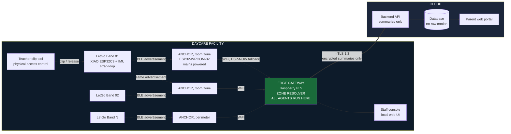
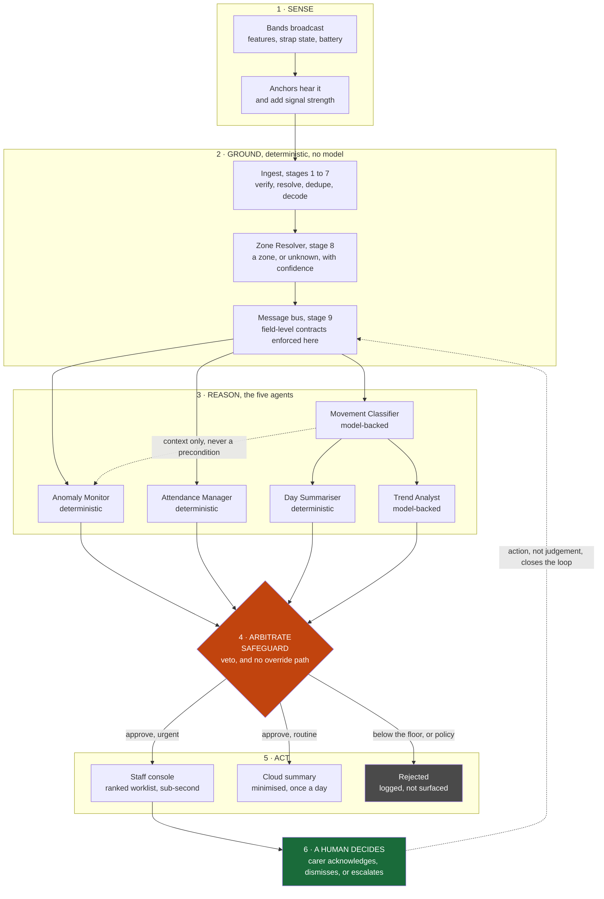
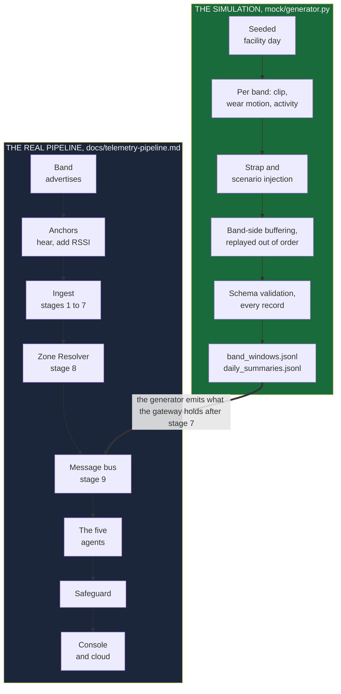

# LetGo Band

An edge-first IoT and multi-agent ecosystem for daycare safety and child
activity monitoring.

**IEEE Computer Society R10 Summer School 2026, Mini Ideathon**
**SDG Track: SDG 3, Good Health and Well-being**

**Status:** this is a design and a simulation. Nothing here is deployed. The
band is a prototype, the classifier has not been trained on real child activity
data, and several parameters in `spec.md` are named as unvalidated. Two things
run today: the mock data generator in [`mock/`](mock/), which stands in for the
bands, and the IMU bring-up rig in
[`demo-imu-data-dash/`](demo-imu-data-dash/), which streams a real six-axis IMU
off an ESP32 and plots it live. Everything between those two ends, the anchors,
the gateway, the Zone Resolver, the agents and the Safeguard, is specified and
not yet built. The table in [What is built](#what-is-built) says which is which,
line by line.

---

## Start here

Four files carry the design. Read them in this order and nothing else is needed.

| Read this | For | Time |
| --- | --- | --- |
| **This README** | The problem, the architecture, how to run it, and the two maps below | 10 min |
| [**`CLAUDE.md`**](CLAUDE.md) | System scope, the four-tier split, and the contract for each of the five agents including its *may not* clauses | 10 min |
| [**`spec.md`**](spec.md) | Inputs, outputs and constraints per tier, the state machines, the parameters, and the failure paths | 15 min |
| [**`docs/`**](docs/) | [blueprint](docs/blueprint.md), [security](docs/security.md), [RAID log](docs/raid.md), [telemetry pipeline](docs/telemetry-pipeline.md), [schema](docs/telemetry-schema.md), [backup](docs/backup-recovery.md) | as needed |

Two maps in this README answer the two questions people ask first:

- [**How the autonomous agents manage the facility**](#how-the-autonomous-agents-manage-the-facility) — the decision loop, who decides what, and where a human sits in it.
- [**The simulated IoT data pipeline**](#the-simulated-iot-data-pipeline) — what the generator produces, where it enters the real pipeline, and what it does not simulate.

In a hurry? [Run the simulation](#how-to-run) takes two commands and about
thirty seconds.

---

## What it is

Daycare centres track attendance on paper and supervise children by line of
sight. Staff-to-child ratios mean no adult can watch every child continuously,
and parents get no record of their child's day beyond a verbal handover.

LetGo Band is a child-worn activity band with a tamper-evident strap. The band
broadcasts and never connects to anything. Mains-powered scanner anchors, one
per zone, hear those broadcasts and forward them to a facility edge gateway that
runs the entire agent workflow locally. Raw motion data never leaves the
building. Only encrypted, minimised summaries reach
the cloud, where parents view their child's day through a scoped portal. The
system automates attendance, detects safety anomalies in seconds, and produces
an activity record that today does not exist.

---

## The problem

What facilities do manually today:

1. **Attendance.** A paper register or tablet form, signed by a parent at
   drop-off. Errors are common, and the register does not know if a child later
   leaves the premises.
2. **Supervision.** Line of sight. One carer covers a group, and a child out of
   view is unmonitored.
3. **Activity records.** None. Parents get a verbal summary at pickup.
4. **Incident detection.** A carer notices, or nobody does.
5. **Pattern recognition.** A carer's memory across weeks, which does not
   survive staff turnover.

We want to be careful about how we frame this. None of it is carer negligence.
It is the physical impossibility of continuous individual attention at legally
permitted staffing ratios. We are automating work that was never humanly
possible, rather than work humans do badly.

---

## Why SDG 3

| SDG 3 element                                 | How we address it                                                                      |
| --------------------------------------------- | -------------------------------------------------------------------------------------- |
| Healthy child development                     | An objective record of active minutes and movement variety, replacing no record at all |
| Injury and harm prevention                    | Second-level detection of device removal, tamper, prolonged stillness, and signal loss |
| Target 3.d, early warning and risk management | Graded escalations to staff rather than raw alarms                                     |
| Continuity of care                            | Longer-term activity pattern deviations flagged for human review                       |

We claim one track only.

**Non-goals, stated up front.** The system does not diagnose. It does not
measure calories or body composition. It does not restrict a child's movement.
It does not produce conclusions about a child, only flags for a human to review.
It does not compare one child to another, and it does not generate per-carer
performance data at all.

---

## Architecture



The most important line on this diagram is the one leaving the building.
Everything to its left is raw data, everything to its right is a summary, and
the agents sit on the left.

Note that band 01 is heard by two anchors at once. That is not redundancy, it is
how zone detection works. A broadcast costs the band the same whether one
listener hears it or four, and comparing the signal strength across anchors is
what tells us which room the child is in.

| Tier       | Where        | What runs here                                                                                                                                       | Why here                                                                                                                                     |
| ---------- | ------------ | ---------------------------------------------------------------------------------------------------------------------------------------------------- | -------------------------------------------------------------------------------------------------------------------------------------------- |
| **Tier 0** | Band         | Sampling, filtering, strap circuit monitoring, step and motion segmentation, feature extraction, local buffer                                        | Must work with no listener in range. Strap events must be instant.                                                                          |
| **Tier 0.5** | Anchors    | Passive BLE scanning, signal strength measurement, forwarding to the gateway. No decoding, no decisions.                                             | One gateway covers 10 to 30 metres indoors through walls. A daycare is bigger. Adding listeners is the fix, not a stronger radio.            |
| **Tier 1** | Edge gateway | Zone Resolver, movement classification model, all five agents, the deterministic Safeguard, attendance reconciliation, staff console, local storage of raw features | Raw child motion must not leave the premises. Latency for safety alerts must be sub-second. The facility must keep working with no internet. |
| **Tier 2** | Cloud        | Parent portal, encrypted daily summaries, multi-site administration, long-horizon storage of summaries only                                          | Parents are off-site. Nothing here is safety-critical.                                                                                       |

We run all agents on the gateway because that single decision solves three
problems at once. Privacy, because raw child motion never leaves the premises.
Availability, because the facility keeps working with no internet. Latency,
because a safety alert cannot wait for a round trip to a data centre.

**The rule we enforce everywhere:** no safety decision depends on Tier 2. If the
internet fails, the facility loses the parent portal and loses nothing else.

### Radio per tier

The band advertises over BLE and never connects to anything. Broadcast has no
concurrent-device ceiling, it is heard by every anchor in range at once, and a
band that never associates holds no network credentials to steal. We rejected
WiFi on the band on power alone: roughly 100 to 250 mA with the radio up against
roughly 10 to 15 mA for BLE advertising, plus a multi-second association on
every wake, which turns multi-day battery life into hours.

Anchors use WiFi because they are on mains power, where radio cost does not
matter. The full reasoning, including why we did not put ESP-NOW on the band, is
in [`spec.md`](spec.md) section 8.

The pattern across the three devices is deliberate: capability increases as
power availability increases. The band is dumb because it runs on a battery. The
gateway is smart because it has a wall socket.

---

## The band


Industrial design concept for the band. Nothing a child can press, and the strap
is one continuous loop with the electronics moulded into it. This is a render
rather than a photograph of a built unit.

Battery powered, no buttons, broadcast only.

| Component          | Part                                                       | Role                                                                                                                                                                                            |
| ------------------ | ---------------------------------------------------------- | ----------------------------------------------------------------------------------------------------------------------------------------------------------------------------------------------- |
| MCU                | XIAO ESP32C3                                               | BLE 5.0 advertising, feature extraction, strap monitoring. Chosen because it is 21 x 17.5 mm with onboard LiPo charging, which most ESP32 boards lack.                                          |
| IMU                | MPU6050 (prototype), BMI270 or LSM6DSOX (pilot)            | 6-axis motion. The upgrade matters: MPU6050 draws around 4 mA continuously, BMI270 runs under 20 µA in low-power motion mode. That is the difference between an 8 hour band and a 5 day band.   |
| Battery            | 3.7 V LiPo, 120 to 150 mAh, JST-PH 1.25                    | Power                                                                                                                                                                                           |
| Strap conductor    | Conductive thread or 34 AWG enamelled wire                 | Continuous loop through the strap                                                                                                                                                               |
| Loop resistor      | 10 kΩ 1%                                                   | Sits inside the strap loop                                                                                                                                                                      |
| Pull-up resistor   | 10 kΩ 1%                                                   | Forms the divider read by the ADC                                                                                                                                                               |
| Fuel gauge (pilot) | MAX17048                                                   | Accurate battery percentage for the low-battery escalation                                                                                                                                      |
| Strap              | Child-size silicone, 14 mm                                 | Body                                                                                                                                                                                            |
| Enclosure          | 3D printed TPU or PLA                                      | Housing                                                                                                                                                                                         |
| Breakaway clip     | Printed with a shear web (prototype), magnetic (production) | Emergency release                                                                                                                                                                               |

### The strap loop

This is the part that is actually novel, and it is four passive components.

A conductive loop runs through the strap with a 10 kΩ resistor inside it, read
through a 10 kΩ pull-up on an ADC pin. The divider gives four distinguishable
states from a single pin:

| Reading     | State                       |
| ----------- | --------------------------- |
| Mid voltage | Clipped, the band is worn   |
| High        | Cut or breakaway            |
| Low         | Shorted, someone is tampering |
| Fluctuating | Fault                       |

A plain GPIO gives two states and cannot tell the difference between a worn band
and someone bridging the contacts to fake "worn". The 10 kΩ in the loop is what
makes the difference: a bridge reads low, and only the real resistor reads mid.

Everything is debounced by roughly 200 ms except tamper, which fires
immediately. A short is not a mechanical event and does not need settling time.

Most wearables cannot distinguish "the person is still" from "the device came
off," so they infer it from motion and get it wrong. We do not have to infer it.
The circuit knows.

Combined with the clip tool signal, these inputs separate four exit conditions:
released by staff tool, mechanical breakaway, cut, and intermittent fault. The
last three are the strap breach class, which is the highest-priority message
class in the system and bypasses normal batching. If the clip tool signal is
absent or ambiguous when the circuit opens, we classify the event as a cut and
escalate. The state machine is in [`spec.md`](spec.md).

### Radio behaviour

The band advertises and never connects during normal operation. No WiFi
credentials, no network association, no connection state. Resolvable private
addresses rotate so that nobody outside the building can log which child arrived
when. Connections are used solely for provisioning and firmware update, in the
dock, one at a time.

A BLE advertisement is 31 bytes, leaving about 26 usable, so the over-the-air
format is compact binary. The JSON in our schema is what the gateway produces
after decoding, and it is not what travels through the air. The byte layout is
in [`spec.md`](spec.md) section 9.

### Why the band has to come off

A band a child cannot remove at all is an entrapment and ligature risk, and it
makes mass evacuation impossible. We use a two-stage release:

1. **Normal release** requires the teacher's clip tool. Childproof by design.
2. **Emergency release** is a calibrated mechanical breakaway. If the band snags
   on playground equipment, or a child pulls hard enough to injure themselves,
   it separates.

Security survives this because detection replaces retention. The strap circuit
registers the breakaway in the same instant it happens. We never depend on the
band staying on. We depend on knowing the moment it comes off.

The clip is printed with a shear web for the prototype and would be magnetic in
production. The breakaway force is the parameter we are least sure of. We have a
typical range and no empirical validation, and it is listed as a calibration
parameter in `spec.md` rather than as a constant, to be measured rather than
assumed.

---

## The anchors

One per zone, mains powered, wall mounted and out of reach. These are the
cheapest part of the system and they do the most work for the feature set.

| Component | Part                                        | Role                                                                                                        |
| --------- | ------------------------------------------- | ----------------------------------------------------------------------------------------------------------- |
| MCU       | ESP32-WROOM-32 dev board                    | Passive BLE scanning plus WiFi uplink. No IMU, no battery, no sensors.                                       |
| Power     | USB power supply and cable                  | Mains. Radio cost is irrelevant here, which is exactly why WiFi belongs on this tier and not on the band.    |
| Enclosure | Small wall-mount box                        | Physical protection, and out of children's reach                                                            |
| Uplink    | WiFi to the facility network, ESP-NOW fallback | Not every facility has usable WiFi coverage in every room, so the fallback matters                        |

Each anchor hears the same advertisement at the same moment and records the
signal strength. It forwards one observation record to the gateway: band id,
anchor id, signal strength, timestamp. That is the entire job. Anchors hold no
keys, decode nothing, and decide nothing.

**Placement priority.** If you deploy only a few, put them at the perimeter
first. The entrance, then each outdoor gate. Perimeter crossing detection is far
more reliable than indoor position and it is the highest-value alert the system
produces.

**What we claim from them.** Zone-level presence, not position. Nearest-anchor
signal strength comparison gives room-level resolution. We do not claim
trilateration, which falls apart indoors because 2.4 GHz is absorbed by bodies
and a room of moving children is a moving radio environment. The limits are
spelled out in [`spec.md`](spec.md) section 10.

---

## The gateway

One per facility. Every agent runs here and this is where the raw data stops.

| Component | Part                                    | Role                                                                                      |
| --------- | --------------------------------------- | ------------------------------------------------------------------------------------------ |
| SBC       | Raspberry Pi 5, 4 GB                    | Runs the Zone Resolver, all five agents, the Safeguard, and the staff console               |
| Storage   | 32 GB A2 microSD                        | OS, local feature retention, audit log                                                      |
| Power     | 27 W USB-C power supply                 | The Pi 5 throttles or refuses to boot on an underpowered supply. Do not substitute.         |
| BLE       | Built-in                                | Passive scanning. It acts as an anchor for its own zone.                                    |
| Network   | Built-in WiFi and Ethernet              | Receives anchor observations, uploads summaries over mTLS                                   |
| UPS       | UPS HAT or powerbank in passthrough     | Covers the power outage dependency in our RAID log                                          |

One practical gotcha we have already hit: BLE scanning on the Pi 5 needs
elevated privileges. Either set capabilities on the Python binary or run the
scanner as a service with the right capabilities. It is worth solving before you
need it.

### How the three relate

|                     | Band                     | Anchor              | Gateway                     |
| ------------------- | ------------------------ | ------------------- | --------------------------- |
| Power               | Battery, days            | Mains               | Mains and UPS               |
| Radio               | BLE advertise only       | BLE scan plus WiFi  | WiFi and Ethernet, BLE scan |
| Network credentials | None                     | Yes                 | Yes                         |
| Quantity            | One per child            | One per zone        | One per facility            |
| Intelligence        | Feature extraction only  | None, pure relay    | Everything                  |

---

## Attendance needs two signals

A band clipped around a chair leg or a bag strap also closes the circuit, so
clip state alone is not attendance.

We require two independent conditions: **circuit closed, plus wear-consistent
motion within a defined window.** A band that clips and then never moves like a
worn band enters `CLIP_FAILED` and goes to staff as a mismatch.

The Attendance Manager reconciles four sources: clip events, motion
confirmation, presence inside the building via anchor coverage, and the expected
roster for the day. Alongside the register entry, it produces the set of
mismatches between those four. Anchor coverage does not change the check-in
rule, which still needs the circuit and the motion. It answers a different
question, which is whether the child is still in the building, and it is what
makes unaccompanied perimeter crossing detectable. The state machine and the
mismatch list are in [`spec.md`](spec.md).

---

## How the autonomous agents manage the facility

This is the agentic AI OS: five autonomous agents sharing one facility, running
side by side on one gateway, arbitrated by a deterministic policy engine none of
them can reach around. Nothing here calls out to a model in a data centre. The
whole loop closes inside the building, in under a second.

### The decision loop

The system runs the same six-step loop continuously, once per feature window per
band, all day.



### What each step is actually doing

| Step | What happens | Autonomy |
| --- | --- | --- |
| **1 Sense** | Bands broadcast into the room. Anchors hear whatever is in range and forward it with their own signal strength. Neither decides anything. | None by design |
| **2 Ground** | The gateway authenticates every advertisement, resolves which band it is, collapses the copies several anchors heard, and turns signal strengths into a zone or into `unknown`. | Deterministic |
| **3 Reason** | Five agents read the fields their contracts name and each answers one question. They run concurrently and do not call each other. | Autonomous, bounded |
| **4 Arbitrate** | Every proposal from every agent hits the Safeguard. It approves urgent, approves routine, or rejects. Conflicts resolve by a fixed precedence order. | Deterministic |
| **5 Act** | Approved output reaches a ranked worklist on the local console, or the daily cloud summary. Rejected output is logged where an auditor can find it. | None, it is routing |
| **6 A human decides** | A carer acts. The system has taken no physical action and cannot. | The human is the actuator |

### Who decides what, and who never decides

The autonomy in this system is deliberately narrow, and the boundary is the
point.

**Agents decide what deserves attention.** They classify, reconcile, detect and
flag. That is real autonomy: no carer asked for any of it, and it happens
continuously whether or not anyone is looking.

**Agents never decide what happens next.** No agent talks to another agent, no
agent writes to the console, no agent reaches the cloud. Every output goes to
the Safeguard and stops there until the Safeguard rules on it. There is no
message path that skips it, and there is no configuration flag that creates one.

**The system never acts on the world.** There is no lock it can close, no door
it can open, no alarm it can sound on its own authority. The final actuator is
always a person walking to a room. This is why zone data is allowed to rank an
alert but never to trigger one on its own.

**The loop closes on actions, not judgements.** When a carer dismisses an alert,
what returns to the bus is that it was dismissed, by whom, at what time. No
agent is retrained by it at run time, and no threshold moves because a busy
carer cleared a queue. That edge is an audit trail, not a feedback signal.

### Why five, and why this split

Each agent owns one question and reads only the fields its contract names, so
that a failure in one cannot become a failure in another.

| Agent | The one question it owns | Type |
| --- | --- | --- |
| Anomaly Monitor | Does someone need to go and look, right now? | Deterministic |
| Attendance Manager | Who is here, and do the four sources agree? | Deterministic |
| Movement Classifier | What is this child doing? | Model-backed |
| Day Summariser | What did the day amount to? | Deterministic |
| Trend Analyst | Has this child drifted from their own baseline? | Model-backed |

The two safety-critical agents are the two deterministic ones that read raw
input directly. Neither sits downstream of the classifier, so a safety event
never waits on a model and never fails because a model failed. Full contracts,
including every *may not* clause, are in [`CLAUDE.md`](CLAUDE.md) section 3,
which also sets out why an agent boundary is the right unit even where the logic
inside it is a rule.

---

## The agents

Five agents, all executing on the edge gateway, with a deterministic Safeguard
in front of every output.

| Agent               | Produces                                                                               | Type          |
| ------------------- | -------------------------------------------------------------------------------------- | ------------- |
| Movement Classifier | Activity classifications with confidence scores                                        | Model-backed  |
| Anomaly Monitor     | Graded anomaly events: signal loss, early power-off, prolonged stillness, strap breach | Deterministic |
| Day Summariser      | Active minutes, movement variety, fitness session participation                        | Deterministic |
| Trend Analyst       | Multi-day activity pattern deviation flags, for staff review only                      | Model-backed  |
| Attendance Manager  | Attendance state transitions and reconciliation mismatches                             | Deterministic |

Each agent carries an explicit _May not_ clause, and those clauses are the
safety contract. The Anomaly Monitor may not suppress a strap breach under any
circumstance. The Day Summariser may not produce calorie or fitness-scoring
output, and never compares one child to another. The Trend Analyst may not
produce a conclusion or characterisation of a child. The Attendance Manager may
not mark a child present on clip state alone. Full contracts are in
[`CLAUDE.md`](CLAUDE.md).

The **Safeguard** is a deterministic policy engine rather than a model. It holds
scoped access rules, the escalation policy, the confidence floor, and the
contraindication list for the Trend Analyst. Every agent proposal passes through
it, and it has three verdicts: approve as urgent to the staff console, approve
as routine to the cloud summary, or reject and log. It has veto power and no
override path. Below the confidence floor it suppresses and logs rather than
guessing.

The orchestration diagram, the failure path table, and an end-to-end walkthrough
are in [`docs/blueprint.md`](docs/blueprint.md).

---

## Connectivity and encryption

Band to anchors, over connectionless BLE 5.0. There is no pairing, no session,
and no link-layer encryption, because there is no link:

- Per-device keys held in ESP32C3 eFuse, not readable by application firmware. Compromising one band compromises one band.
- A truncated HMAC-SHA256 tag on every advertisement. The gateway drops anything it cannot authenticate, and no anchor is trusted to make that check.
- The sequence number sits inside the authenticated bytes, so a captured advertisement cannot be replayed.
- Rotating resolvable private addresses **and** a rotating identifier inside the payload. Rotating one and not the other achieves nothing: anyone within BLE range could otherwise passively log which child arrived when, from the street, with a phone. That is a real privacy attack on children and we treat it as in scope.
- The advertisement is authenticated and not encrypted, and we say so plainly. [`docs/security.md`](docs/security.md) section 8 sets out exactly what an eavesdropper learns, which is a rotating identifier and four motion features belonging to nobody in particular.
- Provisioning in the contactless dock only, never over the air.

Anchors to gateway:

- WiFi, with ESP-NOW as the fallback, on a network segment routed only to the gateway.
- Anchors hold no band keys and no zone map. They forward the bytes they heard and how strongly they heard them, and everything else is re-derived at the gateway.

Gateway to cloud:

- HTTPS or MQTT over TLS 1.3, with mutual TLS and a per-gateway client certificate.
- Short-lived certificates, automatically rotated, revocable per facility.
- Summaries only. The ingest endpoint runs a schema validator that rejects any payload carrying a disallowed field, so minimisation is enforced by code rather than by policy.
- Store and forward on the gateway, so nothing is lost during an outage.
- Monotonic sequence number and timestamp per gateway for replay protection.

Our threat model has four adversaries, including the facility itself acting
against its own staff. Facility reporting is group-level and shift-level, and
per-carer metrics are not generated.

The controls are set out as administrative, technical, and physical, because a
control set that is only technical is not a control set: a rotating identifier
is worthless if the gateway sits unlocked in a corridor. Every control is listed
in a register with its class, the threat it answers, and an honest status of
implemented, designed, or assumed. Most of them are currently assumed, and the
assumptions concentrate in the administrative and physical columns, which is
where a project run by engineers under-invests. Full threat model, access
control matrix, control register, and guardrails are in
[`docs/security.md`](docs/security.md).

---

## Telemetry and backups

How a broadcast becomes a record: the hops, the anchor observation envelope, the
nine ingest stages the gateway runs before an agent sees anything, delivery
guarantees, which buffer overflows first, and the rule that health telemetry
carries no child identity so that monitoring cannot become a second location log.
See [`docs/telemetry-pipeline.md`](docs/telemetry-pipeline.md).

Backups follow one rule: **back up what is expensive to recreate, and do not back
up what is cheap to lose.** The calibration table is a person walking the
building, so it is backed up. Raw feature windows and zone data are excluded
entirely, which keeps a bounded retention window bounded and means that even a
total compromise of the off-site copy exposes no child's movement. Register,
recovery scenarios, the key escrow tension, and how backups interact with a
deletion request are in
[`docs/backup-recovery.md`](docs/backup-recovery.md).

---

## The simulated IoT data pipeline

There is no hardware fleet, so `mock/generator.py` stands in for it. It
simulates a facility day as virtual bands, and emits the records a real gateway
would be holding. That is what lets the agents, the schema, and the failure
paths be developed and demonstrated before a single band exists.

### Where the simulation enters the real pipeline

The honest version of this diagram matters more than a flattering one. The
generator does not simulate the radio, the anchors, or the ingest stages. It
emits what the gateway holds **after** stage 7, and joins the real pipeline
there.



### What the simulation covers, and what it does not

| Pipeline element | Simulated |
| --- | --- |
| Band feature windows, and the two-condition attendance rule | **Yes** |
| Strap events sent unbatched, ahead of the queue | **Yes** |
| Band-side store and forward, replayed out of order | **Yes** |
| Schema validation on every record, non-zero exit on failure | **Yes** |
| Daily summary built from windows, `additionalProperties: false` | **Yes** |
| Anchor envelopes, several anchors hearing one advertisement | **No** |
| Tag verification, `adv_id` resolution, cross-anchor dedupe | **No**, signatures use a fixed demo key |
| Zone resolution, smoothing, hysteresis, calibration | **No** |
| Safeguard confidence floor | **No**, the floor cannot be set until labelled data exists |

The anchor layer is the largest gap, and it is a known one. The generator was
written against the earlier point-to-point topology, so it exercises the agents
and not the ingest path. Generating anchor envelopes with plausible per-anchor
signal strengths is the prerequisite for testing the Zone Resolver at all, and
it is logged as question 6.2 in
[`OPEN-QUESTIONS.md`](OPEN-QUESTIONS.md). The full version of this table is in
[`docs/telemetry-pipeline.md`](docs/telemetry-pipeline.md) section 9.

### What one record looks like

Two streams come out. `band_windows.jsonl` is the gateway-side feature window,
the richest thing in the system and the thing that never leaves the building.
`daily_summaries.jsonl` is the only payload that goes to the cloud, and the
schema enforces that with `additionalProperties: false` so a disallowed field is
rejected structurally rather than by policy. Field-by-field definitions are in
[`docs/telemetry-schema.md`](docs/telemetry-schema.md), and the machine-readable
contract is [`schema/telemetry.schema.json`](schema/telemetry.schema.json).

---

## How to run

Python 3.9 or newer, and one dependency.

```bash
python -m pip install -r mock/requirements.txt

# 12 bands, one day, reproducible
python mock/generator.py --bands 12 --date 2026-09-03 --seed 42 --out out/
```

Expected output, with the path separator your platform uses:

```
band windows: 10793 records -> out/band_windows.jsonl
daily summaries: 12 records -> out/daily_summaries.jsonl
10793 band windows, 12 daily summaries, all valid
```

That run is deterministic. With `--seed 42` and the same flags you get those
record counts every time, which matters when the same scenario has to appear
twice in a demo. `all valid` means every record was checked against
[`schema/telemetry.schema.json`](schema/telemetry.schema.json) before it was
written; a single failure exits non-zero and writes nothing further.

Scenario injection, one flag per failure path we need to show:

```bash
python mock/generator.py --seed 42 --signal-loss          # band goes quiet mid-session
python mock/generator.py --seed 42 --strap-breach         # breakaway or cut
python mock/generator.py --seed 42 --early-poweroff       # band stops before check-out
python mock/generator.py --seed 42 --prolonged-stillness  # clipped, worn, not moving
```

Each scenario flag affects one band, or N bands if you give it a number
(`--signal-loss 3`). With `--out DIR` the generator writes `band_windows.jsonl`
and `daily_summaries.jsonl`, and without it both streams go to stdout. `--seed`
makes a run reproducible, which matters when the same scenario has to appear
twice in a demo.

Every record is validated against the schema before anything is written, and
the run exits non-zero if a record fails. Windows are written in arrival order,
so a radio dropout appears as a gap followed by an out-of-order burst when the
band drains its buffer, which is what the gateway actually sees.

---

## Hardware bring-up, the IMU dashboard

Before a movement classifier can be trained, the sensor has to be trusted. The
rig in [`demo-imu-data-dash/`](demo-imu-data-dash/) is that check: an ESP32-S3 with an
MPU6050 streaming six axes at 100 Hz over BLE, and a single-file browser
dashboard that plots them live over Web Bluetooth. No backend, no build step, no
dependencies.

```
demo-imu-data-dash/
├── index.html                      the dashboard, one file
├── start.bat                       serves it and opens Chrome or Edge
└── sample-imu-data/
    ├── sample-imu-data.ino         ESP32 firmware, Nordic UART service
    └── env.h                       advertised device name
```

Run it by double-clicking `start.bat`, or by hand:

```bash
cd demo-imu-data-dash
python -m http.server 8000     # file:// will not work, Web Bluetooth needs a secure context
```

Chrome or Edge only. Firefox and Safari do not implement Web Bluetooth, and
Brave ships it disabled. The page says so up front rather than failing at
Connect.

The wire format is one newline-terminated CSV line per sample,
`ax,ay,az,gx,gy,gz`, accelerometer in g and gyroscope in deg/s. The charts hold
a 200-sample window and stay raw, because that is where the signal is. The
numeric tiles are smoothed on a 120 ms refresh, because at 100 Hz raw digits are
unreadable. Full setup, the LED status codes, the connection flow, and the
corrections made to the original sketch (unadvertised service UUID, default MTU
splitting every frame, a connection interval too slow for 100 Hz) are in
[`demo-imu-data-dash/README.md`](demo-imu-data-dash/README.md).

**What this proves, and what it does not.** It proves the sensor, the sample
rate, the axis conventions and the frame format, which is what feature
extraction will be built on. It is deliberately not the field topology: it uses
a BLE *connection* to one central, and the deployed band
[connects to nothing](#radio-behaviour) and broadcasts to many anchors instead.
The dashboard is also a viewer and not a recorder, so it does not yet produce
the labelled capture the classifier needs.

---

## What is built

Honest state of each part, so a reviewer does not have to infer it from the
prose.

| Part | State | Where |
| --- | --- | --- |
| System scope, agent contracts, safety precedence | Specified | [`CLAUDE.md`](CLAUDE.md) |
| Interfaces, state machines, parameters, failure paths | Specified | [`spec.md`](spec.md) |
| Telemetry payload shapes and JSON Schema | Specified, and enforced in code | [`schema/`](schema/), [`docs/telemetry-schema.md`](docs/telemetry-schema.md) |
| Mock band and scenario generator | **Runs** | [`mock/generator.py`](mock/generator.py) |
| IMU capture and live plotting over BLE | **Runs**, on an ESP32-S3 and MPU6050 | [`demo-imu-data-dash/`](demo-imu-data-dash/) |
| Band firmware: strap ADC, feature windows, BLE advertising | Not built | designed in [`spec.md`](spec.md) sections 1, 3 and 9 |
| Strap loop, breakaway clip, enclosure | Concept and render, no built unit | [The band](#the-band) |
| Anchor firmware and the anchor-to-zone map | Not built | designed in [`spec.md`](spec.md) sections 8 and 10 |
| Zone Resolver, the five agents, the Safeguard | Not built | designed in [`CLAUDE.md`](CLAUDE.md) sections 3 to 6 |
| Staff console, parent portal, cloud tier | Not built | designed in [`docs/blueprint.md`](docs/blueprint.md) |
| Movement Classifier model | Not trained, no labelled dataset exists | [Known limitations](#known-limitations) |

---

## Repository map

| File                                                           | Contents                                                                                                                               |
| -------------------------------------------------------------- | -------------------------------------------------------------------------------------------------------------------------------------- |
| [`CLAUDE.md`](CLAUDE.md)                                       | System scope, the three-tier split, the five agent contracts with their _May not_ clauses, the Safeguard, and the precedence order     |
| [`spec.md`](spec.md)                                           | Inputs and outputs per tier, the hard constraints, both state machines, the failure path table, and the parameters needing calibration |
| [`docs/blueprint.md`](docs/blueprint.md)                       | Agent orchestration diagram, failure paths, and an end-to-end walkthrough                                                              |
| [`docs/telemetry-schema.md`](docs/telemetry-schema.md)         | Both payload shapes, per-tier computation, and what is stored where                                                                    |
| [`docs/telemetry-pipeline.md`](docs/telemetry-pipeline.md)     | How telemetry actually moves: hops, the anchor envelope, the nine ingest stages, delivery guarantees, buffering, health telemetry      |
| [`docs/backup-recovery.md`](docs/backup-recovery.md)           | What is backed up and what is deliberately not, the register, recovery scenarios, key escrow, backups versus deletion                  |
| [`docs/security.md`](docs/security.md)                         | Threat model, access control matrix, administrative, technical and physical controls, the control register, link encryption            |
| [`docs/raid.md`](docs/raid.md)                                 | Risks, assumptions, issues, dependencies                                                                                               |
| [`schema/telemetry.schema.json`](schema/telemetry.schema.json) | JSON Schema for both payload types                                                                                                     |
| [`mock/generator.py`](mock/generator.py)                       | Simulator for bands and scenarios                                                                                                      |
| [`mock/requirements.txt`](mock/requirements.txt)               | The generator's one dependency, `jsonschema`                                                                                           |
| [`demo-imu-data-dash/`](demo-imu-data-dash/)                         | IMU bring-up rig: ESP32 sketch, Web Bluetooth dashboard, and its own README                                                            |
| [`img/`](img/)                                                 | Product render and logos used in this README                                                                                           |
| [`OPEN-QUESTIONS.md`](OPEN-QUESTIONS.md)                       | What the design does not yet settle                                                                                                    |

---

## Known limitations

- No labelled child activity dataset exists, so the Movement Classifier is
  untrained and the confidence floor cannot be set yet.
- The breakaway force threshold has a typical range and no empirical validation.
- The signal loss threshold depends on measurements in a real facility that we
  have not made.
- The hardware is a prototype. No safety certification work has been done.
- The bring-up rig proves the IMU and the frame format only. It uses a BLE
  connection to one central, which is the opposite of the broadcast topology the
  band deploys with, and it is a viewer rather than a recorder, so it does not
  yet produce training captures.
- Nothing between the band and the parent portal is implemented. The anchors,
  the gateway, the Zone Resolver, the agents and the Safeguard exist as
  specifications and as the contracts in `CLAUDE.md`, not as running code.
