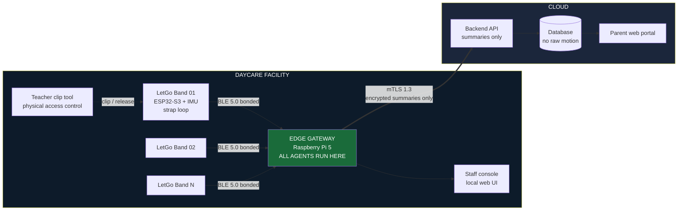
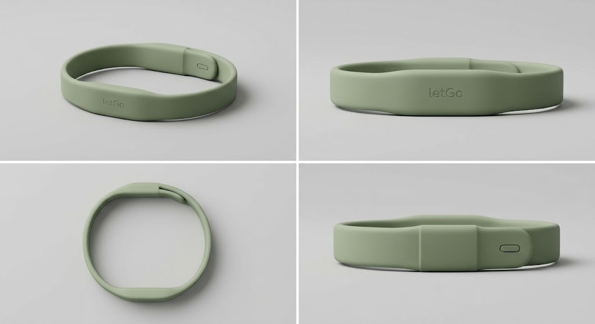

# LetGo Band

An edge-first IoT and multi-agent ecosystem for daycare safety and child
activity monitoring.

**IEEE Computer Society R10 Summer School 2026, Mini Ideathon**
**SDG Track: SDG 3, Good Health and Well-being**

**Status:** this is a design and a simulation. Nothing here is deployed. The
band is a prototype, the classifier has not been trained on real child activity
data, and several parameters in `spec.md` are named as unvalidated. What runs
today is the mock data generator in `mock/`.

---

## What it is

Daycare centres track attendance on paper and supervise children by line of
sight. Staff-to-child ratios mean no adult can watch every child continuously,
and parents get no record of their child's day beyond a verbal handover.

LetGo Band is a child-worn activity band with a tamper-evident strap, connected
to a facility edge gateway that runs the entire agent workflow locally. Raw
motion data never leaves the building. Only encrypted, minimised summaries reach
the cloud, where parents view their child's day through a scoped portal. The
system automates attendance, detects safety anomalies in seconds, and produces
an activity record that today does not exist.

---

## The problem

What facilities do manually today:

1. **Attendance.** A paper register or tablet form, signed by a parent at
   drop-off. Errors are common, and the register does not know if a child later
   leaves the premises.
2. **Supervision.** Line of sight. One carer covers a group, and a child out of
   view is unmonitored.
3. **Activity records.** None. Parents get a verbal summary at pickup.
4. **Incident detection.** A carer notices, or nobody does.
5. **Pattern recognition.** A carer's memory across weeks, which does not
   survive staff turnover.

We want to be careful about how we frame this. None of it is carer negligence.
It is the physical impossibility of continuous individual attention at legally
permitted staffing ratios. We are automating work that was never humanly
possible, rather than work humans do badly.

---

## Why SDG 3

| SDG 3 element                                 | How we address it                                                                      |
| --------------------------------------------- | -------------------------------------------------------------------------------------- |
| Healthy child development                     | An objective record of active minutes and movement variety, replacing no record at all |
| Injury and harm prevention                    | Second-level detection of device removal, tamper, prolonged stillness, and signal loss |
| Target 3.d, early warning and risk management | Graded escalations to staff rather than raw alarms                                     |
| Continuity of care                            | Longer-term activity pattern deviations flagged for human review                       |

We claim one track only.

**Non-goals, stated up front.** The system does not diagnose. It does not
measure calories or body composition. It does not restrict a child's movement.
It does not produce conclusions about a child, only flags for a human to review.
It does not compare one child to another, and it does not generate per-carer
performance data at all.

---

## Architecture



The most important line on this diagram is the one leaving the building.
Everything to its left is raw data, everything to its right is a summary, and
the agents sit on the left.

| Tier       | Where        | What runs here                                                                                                                                       | Why here                                                                                                                                     |
| ---------- | ------------ | ---------------------------------------------------------------------------------------------------------------------------------------------------- | -------------------------------------------------------------------------------------------------------------------------------------------- |
| **Tier 0** | Band         | Sampling, filtering, strap circuit monitoring, step and motion segmentation, feature extraction, local buffer                                        | Must work with the gateway out of range. Strap events must be instant.                                                                       |
| **Tier 1** | Edge gateway | Movement classification model, all five agents, the deterministic Safeguard, attendance reconciliation, staff console, local storage of raw features | Raw child motion must not leave the premises. Latency for safety alerts must be sub-second. The facility must keep working with no internet. |
| **Tier 2** | Cloud        | Parent portal, encrypted daily summaries, multi-site administration, long-horizon storage of summaries only                                          | Parents are off-site. Nothing here is safety-critical.                                                                                       |

We run all agents on the gateway because that single decision solves three
problems at once. Privacy, because raw child motion never leaves the premises.
Availability, because the facility keeps working with no internet. Latency,
because a safety alert cannot wait for a round trip to a data centre.

**The rule we enforce everywhere:** no safety decision depends on Tier 2. If the
internet fails, the facility loses the parent portal and loses nothing else.

---

## The band



Industrial design concept for the band. Nothing a child can press, and the strap
is one continuous loop with the electronics moulded into it. This is a render
rather than a photograph of a built unit.

| Component             | Purpose                                                                      |
| --------------------- | ---------------------------------------------------------------------------- |
| ESP32-S3              | MCU, BLE 5.0, on-device feature extraction, secure element for key storage   |
| 6-axis IMU            | Accelerometer and gyroscope for activity classification and wear-consistency |
| Conductive strap loop | Continuous circuit through the band. Closed means worn.                      |
| Safety clip           | Requires the teacher's tool for normal release                               |
| Calibrated breakaway  | Mechanical separation at a specified force, typically 20 to 30 N             |
| LiPo cell             | Multi-day operation, charged in a contactless dock                           |
| No external buttons   | Nothing a child can press. Provisioning happens in the dock.                 |

### The strap loop

A conductive loop through the strap forms a closed circuit monitored by a GPIO
pin. Closed means worn.

This is the piece of the design we care most about. Most wearables cannot
distinguish "the person is still" from "the device came off," so they infer it
from motion and get it wrong. We do not have to infer it. The circuit knows.

Combined with the clip tool signal, two inputs separate four exit conditions:
released by staff tool, mechanical breakaway, cut, and intermittent fault. The
last three are the strap breach class, which is the highest-priority message
class in the system and bypasses normal batching. If the clip tool signal is
absent or ambiguous when the circuit opens, we classify the event as a cut and
escalate. The state machine is in [`spec.md`](spec.md).

### Why the band has to come off

A band a child cannot remove at all is an entrapment and ligature risk, and it
makes mass evacuation impossible. We use a two-stage release:

1. **Normal release** requires the teacher's clip tool. Childproof by design.
2. **Emergency release** is a calibrated mechanical breakaway. If the band snags
   on playground equipment, or a child pulls hard enough to injure themselves,
   it separates.

Security survives this because detection replaces retention. The strap circuit
registers the breakaway in the same instant it happens. We never depend on the
band staying on. We depend on knowing the moment it comes off.

The breakaway force is the parameter we are least sure of. We have a typical
range and no empirical validation, and it is listed as a calibration parameter
in `spec.md` rather than as a constant.

---

## Attendance needs two signals

A band clipped around a chair leg or a bag strap also closes the circuit, so
clip state alone is not attendance.

We require two independent conditions: **circuit closed, plus wear-consistent
motion within a defined window.** A band that clips and then never moves like a
worn band enters `CLIP_FAILED` and goes to staff as a mismatch.

The Attendance Manager reconciles three sources: clip events, motion
confirmation, and the expected roster for the day. Alongside the register entry,
it produces the set of mismatches between those three. The state machine and the
mismatch list are in [`spec.md`](spec.md).

---

## The agents

Five agents, all executing on the edge gateway, with a deterministic Safeguard
in front of every output.

| Agent               | Produces                                                                               | Type          |
| ------------------- | -------------------------------------------------------------------------------------- | ------------- |
| Movement Classifier | Activity classifications with confidence scores                                        | Model-backed  |
| Anomaly Monitor     | Graded anomaly events: signal loss, early power-off, prolonged stillness, strap breach | Deterministic |
| Day Summariser      | Active minutes, movement variety, fitness session participation                        | Deterministic |
| Trend Analyst       | Multi-day activity pattern deviation flags, for staff review only                      | Model-backed  |
| Attendance Manager  | Attendance state transitions and reconciliation mismatches                             | Deterministic |

Each agent carries an explicit _May not_ clause, and those clauses are the
safety contract. The Anomaly Monitor may not suppress a strap breach under any
circumstance. The Day Summariser may not produce calorie or fitness-scoring
output, and never compares one child to another. The Trend Analyst may not
produce a conclusion or characterisation of a child. The Attendance Manager may
not mark a child present on clip state alone. Full contracts are in
[`CLAUDE.md`](CLAUDE.md).

The **Safeguard** is a deterministic policy engine rather than a model. It holds
scoped access rules, the escalation policy, the confidence floor, and the
contraindication list for the Trend Analyst. Every agent proposal passes through
it, and it has three verdicts: approve as urgent to the staff console, approve
as routine to the cloud summary, or reject and log. It has veto power and no
override path. Below the confidence floor it suppresses and logs rather than
guessing.

The orchestration diagram, the failure path table, and an end-to-end walkthrough
are in [`docs/blueprint.md`](docs/blueprint.md).

---

## Connectivity and encryption

Band to gateway, over BLE 5.0:

- LE Secure Connections with bonding, so key agreement resists passive eavesdropping.
- Per-device keys in the ESP32-S3 secure element. Compromising one band compromises one band.
- Rotating resolvable private addresses. Without this, anyone within BLE range could passively log which child arrived when, from the street, with a phone. That is a real privacy attack on children and we treat it as in scope.
- AES-128-CCM at the link layer, plus an application-layer HMAC per packet. The gateway drops anything it cannot authenticate.
- Provisioning in the contactless dock only, never over the air.

Gateway to cloud:

- HTTPS or MQTT over TLS 1.3, with mutual TLS and a per-gateway client certificate.
- Short-lived certificates, automatically rotated, revocable per facility.
- Summaries only. The ingest endpoint runs a schema validator that rejects any payload carrying a disallowed field, so minimisation is enforced by code rather than by policy.
- Store and forward on the gateway, so nothing is lost during an outage.
- Monotonic sequence number and timestamp per gateway for replay protection.

Our threat model has four adversaries, including the facility itself acting
against its own staff. Facility reporting is group-level and shift-level, and
per-carer metrics are not generated. The full threat model, access control
matrix, and guardrails are in [`docs/security.md`](docs/security.md).

---

## Running the simulation

`mock/generator.py` simulates N bands across a configurable day and emits
records that validate against `schema/telemetry.schema.json`. We use it to
develop the gateway pipeline and to demonstrate the failure paths without
hardware.

```bash
python -m pip install -r mock/requirements.txt

# 12 bands, one day, reproducible
python mock/generator.py --bands 12 --date 2026-09-03 --seed 42 --out out/
```

Scenario injection, one flag per failure path we need to show:

```bash
python mock/generator.py --seed 42 --signal-loss          # band goes quiet mid-session
python mock/generator.py --seed 42 --strap-breach         # breakaway or cut
python mock/generator.py --seed 42 --early-poweroff       # band stops before check-out
python mock/generator.py --seed 42 --prolonged-stillness  # clipped, worn, not moving
```

Each scenario flag affects one band, or N bands if you give it a number
(`--signal-loss 3`). With `--out DIR` the generator writes `band_windows.jsonl`
and `daily_summaries.jsonl`, and without it both streams go to stdout. `--seed`
makes a run reproducible, which matters when the same scenario has to appear
twice in a demo.

Every record is validated against the schema before anything is written, and
the run exits non-zero if a record fails. Windows are written in arrival order,
so a radio dropout appears as a gap followed by an out-of-order burst when the
band drains its buffer, which is what the gateway actually sees.

---

## Repository map

| File                                                           | Contents                                                                                                                               |
| -------------------------------------------------------------- | -------------------------------------------------------------------------------------------------------------------------------------- |
| [`CLAUDE.md`](CLAUDE.md)                                       | System scope, the three-tier split, the five agent contracts with their _May not_ clauses, the Safeguard, and the precedence order     |
| [`spec.md`](spec.md)                                           | Inputs and outputs per tier, the hard constraints, both state machines, the failure path table, and the parameters needing calibration |
| [`docs/blueprint.md`](docs/blueprint.md)                       | Agent orchestration diagram, failure paths, and an end-to-end walkthrough                                                              |
| [`docs/telemetry-schema.md`](docs/telemetry-schema.md)         | Both payload shapes, per-tier computation, and what is stored where                                                                    |
| [`docs/security.md`](docs/security.md)                         | Threat model, access control matrix, encryption tables, guardrails                                                                     |
| [`docs/raid.md`](docs/raid.md)                                 | Risks, assumptions, issues, dependencies                                                                                               |
| [`schema/telemetry.schema.json`](schema/telemetry.schema.json) | JSON Schema for both payload types                                                                                                     |
| [`mock/generator.py`](mock/generator.py)                       | Simulator for bands and scenarios                                                                                                      |
| [`OPEN-QUESTIONS.md`](OPEN-QUESTIONS.md)                       | What the design does not yet settle                                                                                                    |

---

## Known limitations

- No labelled child activity dataset exists, so the Movement Classifier is
  untrained and the confidence floor cannot be set yet.
- The breakaway force threshold has a typical range and no empirical validation.
- The signal loss threshold depends on measurements in a real facility that we
  have not made.
- The hardware is a prototype. No safety certification work has been done.
