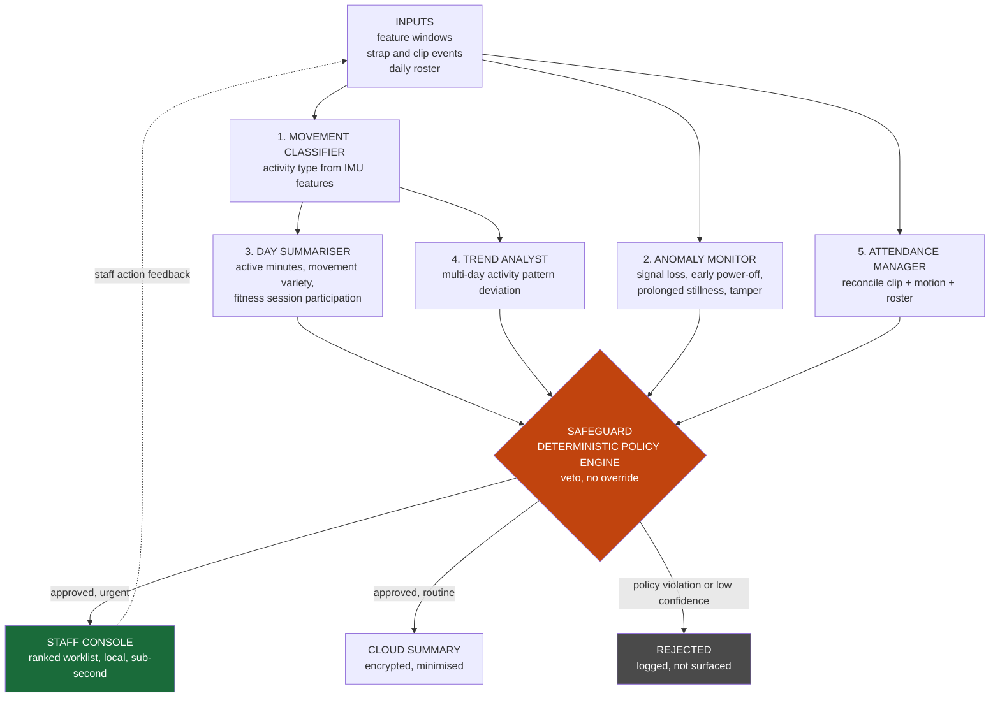

# Agent orchestration blueprint

How the five agents and the Safeguard fit together on the edge gateway, what
happens when a part of the system fails, and one scenario followed end to end.

Agent contracts are in [`../CLAUDE.md`](../CLAUDE.md). State machines and
parameters are in [`../spec.md`](../spec.md).

---

## 1. Orchestration

All agents execute on the edge gateway. This is the privacy architecture and the
availability architecture at the same time.

Three properties of this graph are worth naming.

**The Anomaly Monitor and the Attendance Manager read the raw inputs directly.**
Neither sits downstream of the Movement Classifier. A safety event therefore
never waits on a model, and never fails because a model failed.

**Everything converges on the Safeguard before it reaches a person.** There is
no edge from an agent to the staff console or to the cloud. The Safeguard is not
a filter placed on one path, it is the only path.

**The feedback edge carries staff actions, not staff judgements.** What returns
to the input layer is that an alert was acknowledged, dismissed, or escalated,
with a timestamp and a badge. No agent is retrained by it at run time.

---

## 2. Failure paths

| Condition | System behaviour |
|---|---|
| Gateway unreachable from band | Band buffers locally, continues strap monitoring, replays on reconnect |
| Internet down | Facility fully operational. Parent portal stale. No safety function lost. |
| Classifier confidence below floor | Safeguard suppresses. Logged, not surfaced. Never guessed. |
| Strap breach | Highest priority. Bypasses batching. Escalates immediately regardless of any other agent state. |
| Conflicting agent outputs | Safeguard precedence order applies. Safety outranks summary, always. |
| Band battery critical | Escalates to staff before depletion, not after |
| Signal loss after check-in | Anomaly Monitor escalates within a defined threshold interval, distinguishes radio dropout from removal using last known strap state |
| Gateway down | Bands buffer to local storage and keep monitoring the strap. Staff console unavailable, so the facility falls back to the paper register for the outage. The gateway runs on a UPS to keep this rare. |
| Cloud ingest rejects a payload | Payload is quarantined on the gateway with the validator error and retried after correction. Nothing is silently dropped. |
| Roster missing or stale | Attendance runs on clip plus motion alone, and every child is raised as a "not on roster" mismatch rather than the day failing. |
| Clip tool signal ambiguous at release | Event is classified `CUT` and escalates. The system errs towards escalation. |
| Two bands report the same `child_ref` | Both are flagged as a reconciliation mismatch. Neither is trusted for attendance until staff resolve it. |
| Band clock drift | The gateway timestamps on receipt and records the band-reported time separately. Sequence numbers order the windows. |

---

## 3. Walkthrough: a band goes silent

This is the scenario we care most about, because it is the one where a single
threshold rule gives the wrong answer. A band stops reporting. Three very
different things could have happened, and the correct response differs in each
case.

### 3.1 Check-in

08:41. A carer clips band `lgb-0142` onto a child and the strap circuit closes.
The band emits a clip event immediately and enters `CLIPPED`.

The Attendance Manager sees the clip event and the child assignment, and moves
the child to `CLIP_PENDING`. It does not record attendance. A band clipped
around a chair leg would look identical at this instant.

Over the next windows the band sends feature windows showing wear-consistent
motion. Inside the 120 s `motion_confirmation_window`, the second condition is
satisfied and the Attendance Manager moves the child to `PRESENT`. The check-in
time goes into the attendance record. No alert is raised, because nothing is
wrong.

### 3.2 The band stops reporting

11:07. Feature windows from `lgb-0142` stop arriving.

The Anomaly Monitor notices the gap. What it does next depends on two facts it
already holds, neither of which comes from the classifier:

- The last strap state received from the band.
- Whether a strap event arrived out of band before the silence.

Strap events are sent unbatched, ahead of any queued feature window, so a breach
reaches the gateway even when the window queue is backed up.

### 3.3 The three cases, separated

| Evidence at the gateway | Reading | Escalation |
|---|---|---|
| Last strap state `CLIPPED`, no strap event received, no clip tool release | Radio dropout. The band is probably still worn and still recording. | `SIGNAL_LOST`. Locate the child, which is a check rather than an emergency. The band's buffered windows will replay on reconnect. |
| `RELEASED_BY_TOOL` event received, attributed to a staff badge, then silence | Staff removal. Expected, and the silence follows from the removal. | No safety escalation. The Attendance Manager records the release. If it is not end of day, this raises an attendance mismatch rather than an alarm. |
| `BREAKAWAY`, `CUT`, or `FAULT` event received, then silence | Strap breach. The band came off under force, was cut, or has failed. | Highest priority. Bypasses batching, goes to the top of the staff worklist immediately, and no other agent state can delay or suppress it. |

The distinction between rows one and three is the point of the strap circuit.
Without it, both look like a band that stopped talking, and the system either
alarms on every radio dropout or misses a real removal. With it, the gateway
does not have to infer which happened. It already has the answer, because the
circuit reported the breach before the radio went quiet.

Row two is the point of the clip tool signal. If that signal is absent or
ambiguous when the circuit opens, the event is classified `CUT` and the system
takes row three. We would rather send a carer to check on a child unnecessarily
than classify a real removal as routine.

### 3.4 What the Safeguard does with it

Each reading arrives at the Safeguard as an agent proposal.

- The strap breach is approved as urgent and reaches the staff console
  sub-second. The Safeguard has no rule that can reject it, and the Anomaly
  Monitor's contract forbids it from being withheld.
- `SIGNAL_LOST` is approved as urgent, ranked below the breach.
- The staff removal produces no alert. It produces an attendance state change,
  and a reconciliation mismatch if it happened outside the expected pickup
  window.
- Any Movement Classifier output for the windows around the gap is unaffected by
  all of this. If its confidence is below the floor, the Safeguard suppresses
  and logs it. That suppression does not touch the anomaly, because the anomaly
  never depended on the classifier.

### 3.5 Resolution and what reaches the cloud

A carer acknowledges the alert on the console and resolves it. The action is
logged with a badge and a timestamp, and the alert is not deleted.

At the end of the day, the cloud receives the daily summary for this child. It
contains the check-in and check-out times, the activity totals, and
`anomaly_events_resolved: 1`. It does not contain which anomaly, when it
happened, what the strap state was, or any of the feature windows. A parent sees
that something was flagged and resolved, and the detail stays inside the
building where the people who can act on it are.
