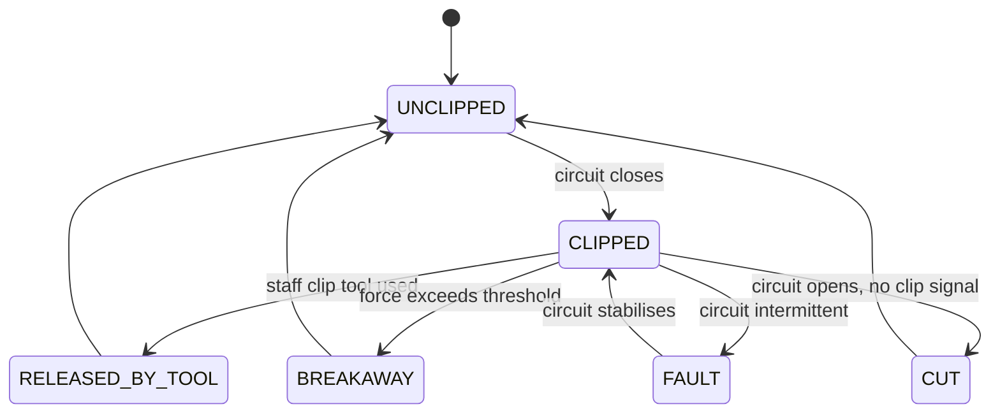
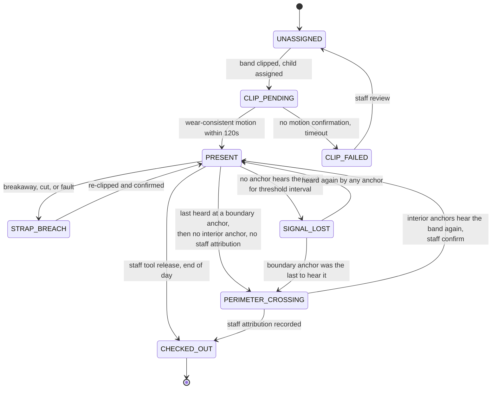

# LetGo Band, technical specification

How the system works. Scope, agent responsibilities, and the safety contract are
in `CLAUDE.md`. This file covers interfaces per tier, the hard constraints, the
two state machines, the failure path table, and the parameters that need
calibration before any deployment.

Sections 8, 9 and 10 cover the radio topology: why each tier uses the radio it
uses, the binary layout of the band advertisement, and how a zone is determined
along with what we will and will not claim from it. They are at the end because
sections 1 to 7 are referenced by section number from the other files in this
repo, and renumbering would have broken those references.

Components and the strap circuit are in `docs/hardware.md`.

---

## 1. Inputs and outputs per tier

### Tier 0, the band

| | |
|---|---|
| | |
|---|---|
| **Inputs** | 6-axis IMU sample stream (accelerometer and gyroscope). Strap loop voltage on an ADC pin, see `docs/hardware.md`. Clip tool signal. Battery state. Dock contact during provisioning and charging. |
| **Outputs** | Connectionless BLE advertisements, one per `window_s`, carrying the compact binary payload defined in section 9. Strap breach advertisements, emitted immediately and repeated, ahead of the normal advertising cadence. |
| **Local state** | Rolling raw sample buffer, current strap state, current clip state, sequence counter, advertising identifier epoch, unsent-window queue. |

The band computes features and discards raw samples on a rolling basis. It never
transmits raw samples.

The band has no output that depends on anything hearing it. It advertises into
the room whether or not an anchor is listening, and it keeps monitoring the
strap either way.

### Tier 0.5, the scanner anchors

| | |
|---|---|
| **Inputs** | BLE advertisements from every band in range. Mains power. |
| **Outputs** | Anchor observation records to the gateway over WiFi, with ESP-NOW as the fallback: the raw advertisement bytes as heard, the anchor's own identifier, the received signal strength, and the receive timestamp. |
| **Local state** | A short forwarding queue, and nothing else that survives a power cycle. |

Anchors do not decode, authenticate, aggregate, or interpret. They hold no band
keys and no zone map. An anchor that is compromised can report a signal strength
that is not true, and it cannot forge a band, resolve a band identifier, or
assign a zone.

### Tier 1, the edge gateway

| | |
|---|---|
| **Inputs** | Anchor observation records from every anchor. Daily roster from the facility. Staff actions from the local console (acknowledge, dismiss, escalate, clip tool release attribution). The anchor-to-zone map and the facility calibration table. |
| **Outputs** | Staff console alerts, ranked, local, sub-second. Zone assignments with confidence. Attendance state transitions and reconciliation mismatches. Daily summary per child, pushed to the cloud. Append-only audit log entries. |
| **Local state** | Raw feature history per child for a facility-set retention window. Activity classifications. Zone assignment and smoothing state per band per anchor. Attendance state per child. Open anomalies. Trend baselines. Store-and-forward queue for the cloud link. |

The gateway is the first tier that can tell which band it is looking at. It
verifies the authentication tag on every advertisement, resolves the rotating
advertising identifier to a band, deduplicates the copies forwarded by several
anchors, and only then hands a feature window to the agents.

### Tier 2, the cloud

| | |
|---|---|
| **Inputs** | Daily summary payloads over mTLS, one per child per day, schema-validated at ingest. |
| **Outputs** | Parent portal views scoped to a single child. Multi-site administrative aggregates. |
| **Stored** | Daily summaries, attendance records, and resolved anomaly counts. Nothing else. |

---

## 2. Constraints, as hard rules

These are not preferences. An implementation that breaks one of them is not this
system.

1. **All agents execute on the edge gateway.** No agent, and no part of an
   agent, runs on the band or in the cloud.
2. **Raw IMU data never leaves the facility.** Raw samples do not leave the band.
   Extracted features do not leave the gateway. The cloud has no representation
   of a child's motion at any resolution finer than a daily total.
3. **No safety decision depends on the cloud.** Every escalation path terminates
   at the local staff console. The WAN link carries summaries and nothing that a
   carer needs in order to act.
4. **The band has no external buttons.** There is nothing a child can press.
   Provisioning and pairing happen in the contactless dock, never over the air.
5. **The strap circuit is the authority on wear.** No classifier output can
   assert that a band is worn when the circuit says open, and none can assert it
   is off when the circuit says closed.
6. **A strap breach is never suppressed.** Not by low confidence, not by
   attendance state, not by batching, not by an open alert of any other kind.
7. **Below the confidence floor, output is suppressed and logged.** The system
   fails to `unknown`. It does not fail to a best guess.
8. **The Safeguard has no override path.** See `CLAUDE.md` section 5.
9. **The cloud ingest endpoint rejects payloads containing disallowed fields.**
   Data minimisation is enforced by the schema validator, not by policy.
10. **Per-carer performance data is not generated.** There is no table to
    disable and no report to switch off, because the data does not exist.
11. **The band never associates with anything in the field.** It advertises and
    it listens to nothing. BLE connections happen only in the dock, for
    provisioning and firmware update, one device at a time.
12. **The band holds no network credentials.** No WiFi password, no facility
    network key, no peer list. A lost or stolen band is not a route into the
    facility network, because there is nothing on it to use.
13. **Anchors hold no band keys and assign no zones.** They forward what they
    heard and how strongly they heard it. Authentication and zone assignment
    both happen on the gateway.
14. **Zone data never stands alone.** It may enrich, rank, or route an alert,
    and it may raise a perimeter crossing for a carer to check. No
    safety-critical decision rests on signal strength alone, and no automatic
    action is taken on it. See the signal trust hierarchy in `CLAUDE.md`
    section 6.
15. **The over-the-air payload is compact binary.** The JSON in
    `docs/telemetry-schema.md` is the gateway-side representation after
    decoding, and it is not what travels through the air.

---

## 3. The strap state machine

The strap loop is a conductive circuit running through the band, monitored on a
GPIO pin. Closed means worn. The clip tool signal is the second input, and the
two together separate four exit conditions that a single sensor would confuse.

| State | Meaning | Handling |
|---|---|---|
| `UNCLIPPED` | Circuit open, band not on a child | Normal. No child is assigned to this band. |
| `CLIPPED` | Circuit closed | Necessary for attendance, not sufficient. See section 4. |
| `RELEASED_BY_TOOL` | Circuit opened with a clip tool signal present | Expected removal. Logged and attributed to a staff badge. |
| `BREAKAWAY` | Mechanical separation at the calibrated force | Strap breach. Highest priority message class, bypasses batching. |
| `CUT` | Circuit opened with no clip tool signal and no breakaway | Strap breach. Highest priority message class, bypasses batching. |
| `FAULT` | Circuit intermittent | Strap breach class. Escalates as a device fault, not as a removal. |

`BREAKAWAY`, `CUT`, and `FAULT` are the strap breach class. They are sent
immediately on their own, ahead of any queued feature windows, and the Anomaly
Monitor may not suppress them.

Distinguishing `RELEASED_BY_TOOL` from `CUT` needs the clip tool signal to be
present at the moment the circuit opens. If the clip tool signal is absent or
ambiguous, the event is classified as `CUT`. The system errs towards escalation.

---

## 4. The attendance state machine

A band clipped around a chair leg or a bag strap also closes the circuit. Clip
state alone is therefore not attendance.

**Attendance requires two independent conditions:** circuit closed, plus
wear-consistent motion within a defined window.

Anchor coverage is a third signal, and it does not change that rule. Check-in
still needs the circuit and the motion. Coverage answers a different question,
which is whether the child is still inside the building, and it is what makes
the perimeter crossing state below possible.

Zone is an attribute of a band, not a state of the machine above. A child moving
between rooms stays `PRESENT` and their zone assignment changes underneath them.
Only leaving the building changes the state.

| State | Entry condition | Who is told |
|---|---|---|
| `UNASSIGNED` | No child assigned to this band | Nobody |
| `CLIP_PENDING` | Circuit closed and a child assigned, motion not yet confirmed | Nobody, unless it times out |
| `PRESENT` | Circuit closed and wear-consistent motion inside `motion_confirmation_window` | Attendance record, staff console roster view |
| `CLIP_FAILED` | `motion_confirmation_window` elapsed with no wear-consistent motion | Staff, as a reconciliation mismatch |
| `STRAP_BREACH` | Any of `BREAKAWAY`, `CUT`, `FAULT` | Staff, immediately, highest priority |
| `SIGNAL_LOST` | No anchor has heard the band for `signal_loss_threshold` after check-in | Staff, graded by last known strap state and by which anchor heard it last |
| `PERIMETER_CROSSING` | A boundary anchor was the last to hear the band, no interior anchor hears it now, and no staff attribution exists inside `accompaniment_window` | Staff, immediately, on its own escalation path alongside strap breach |
| `CHECKED_OUT` | Clip tool release attributed to a staff badge at end of day | Attendance record, parent portal |

### Perimeter crossing

A crossing is treated as unaccompanied unless a staff-attributed release or a
staff check-out action exists for that child inside `accompaniment_window`. As
with the clip tool signal, an ambiguous case escalates. We would rather send a
carer to the door for nothing than record a child leaving the building as
routine.

Two properties make this detection worth having, and both are worth stating
plainly because they are what separate it from indoor positioning.

It is a coverage question rather than a position question. The system does not
ask where the band is, it asks whether any interior anchor can hear it at all.
Coverage at a boundary is the one place where signal strength gives a clean
answer, because the wall is the discontinuity.

It is still probabilistic, so it escalates to a human and never triggers an
automatic action. The alert carries what it was raised on: last strap state,
last motion, which anchors last heard the band, and the zone confidence at the
time.

### Reconciliation

The Attendance Manager reconciles four independent sources: clip events, motion
confirmation, presence inside the building via anchor coverage, and the expected
roster for the day. Its output is the set of mismatches between those four, and
it also drives the register entry.

Reconciliation mismatches it can raise:

| Mismatch | Meaning |
|---|---|
| Roster expects, no band | A child on today's roster has no band in `PRESENT` state. |
| Band present, not on roster | A band reports `PRESENT` for a child not expected today. |
| Clipped, never confirmed | `CLIP_FAILED`. Circuit closed on something that is not a moving child. |
| Present past expected pickup | `PRESENT` continues past the rostered end of day. |
| Checked out, still reporting | `CHECKED_OUT` band continues to advertise wear-consistent windows. |
| Present, no coverage | Circuit and motion say worn, and no anchor has heard the band. Either the band is out of the building or an anchor has failed. |
| Coverage, no clip | Anchors hear a band that is not clipped. A band left on a shelf, or a band assigned to a child who is not wearing it. |
| Zone unknown while present | The Zone Resolver has returned `unknown` for longer than `zone_hold_interval`, which usually means an anchor is down rather than a child is missing. |

---

## 5. Failure paths

| Condition | System behaviour |
|---|---|
| No anchor in range of a band | Band keeps advertising and keeps monitoring the strap. Windows produced while unheard are buffered and re-advertised on the band's replay schedule. |
| Internet down | Facility fully operational. Parent portal stale. No safety function lost. |
| Classifier confidence below floor | Safeguard suppresses. Logged, not surfaced. Never guessed. |
| Strap breach | Highest priority. Bypasses batching. Escalates immediately regardless of any other agent state. |
| Unaccompanied perimeter crossing | Highest priority, own escalation path alongside strap breach. Carries its corroborating evidence and its confidence. |
| Conflicting agent outputs | Safeguard precedence order applies. Safety outranks summary, always. |
| Band battery critical | Escalates to staff before depletion, not after |
| Signal loss after check-in | Anomaly Monitor escalates within a defined threshold interval, distinguishes radio dropout from removal using last known strap state |
| Band heard by a different anchor than before | Handover. Not an anomaly. The Zone Resolver applies hysteresis and the attendance state does not change. |
| Band heard by fewer anchors, and weakening | Coverage edge. Not yet an anomaly. If the last anchor to hear it is a boundary anchor, the Attendance Manager evaluates a perimeter crossing. |
| Band heard by no anchor at all | Genuine silence. `SIGNAL_LOST` after `signal_loss_threshold`, graded by which anchor heard it last. |
| One anchor fails | Its zone becomes a blind spot. Neighbouring anchors may still hear bands there at lower signal strength, so the Zone Resolver returns `unknown` rather than assigning the neighbouring zone. Anchor health is monitored and an anchor that stops forwarding raises its own alert. |
| Facility WiFi down | Anchors fall back to ESP-NOW to the gateway. Zone detection continues. |
| Advertisement fails tag verification | Dropped at the gateway and logged. It never reaches an agent. |
| Advertisement replayed by an attacker | Rejected on the sequence number, which is inside the authenticated bytes. A replayed advertisement carries a sequence number the gateway has already seen. |
| Zone flapping between two anchors | Hysteresis holds the current zone. If the margin stays below `zone_hysteresis_margin`, the Zone Resolver returns `unknown` rather than alternating. |
| Calibration table missing | The Zone Resolver falls back to nearest-anchor comparison alone and marks its output low confidence. Zone enrichment continues, and nothing safety-critical changes, because nothing safety-critical rested on zone in the first place. |
| Gateway down | Bands buffer to local storage and keep monitoring the strap. Staff console unavailable, so the facility falls back to the paper register for the outage. Gateway runs on a UPS to make this rare. |
| Cloud ingest rejects a payload | Payload is quarantined on the gateway with the validator error, and retried after correction. Nothing is silently dropped. |
| Roster missing or stale | Attendance runs on clip plus motion alone and every child is raised as a "not on roster" mismatch, rather than the day failing. |
| Clip tool signal ambiguous at release | Event is classified `CUT` and escalates. The system errs towards escalation. |
| Two bands report the same `child_ref` | Both are flagged as a reconciliation mismatch. Neither is trusted for attendance until staff resolve it. |
| Band clock drift | Gateway timestamps on receipt and records the band-reported time separately. Sequence numbers order the windows. |

---

## 6. Parameters requiring calibration

These are parameters, not constants. Each needs empirical validation before
deployment, and each is configurable per facility unless noted.

| Parameter | Current working value | What it controls | How it gets settled |
|---|---|---|---|
| `breakaway_force_threshold` | Typically 20 to 30 N | Force at which the strap separates mechanically | Physical testing against child anthropometric data and playground snag scenarios. Must release before injury and must not release during normal play. Not user-configurable, it is set mechanically at manufacture. |
| `motion_confirmation_window` | 120 s | Time allowed between circuit close and wear-consistent motion before `CLIP_FAILED` | Pilot observation of real drop-off. Too short flags sleeping and carried children, too long delays the register. |
| `confidence_floor` | Not yet set | Classifier confidence below which the Safeguard suppresses output | Calibration against a staff-labelled validation set. Set from the false-positive rate a facility will tolerate on the staff console. |
| `signal_loss_threshold` | Not yet set | Time without a packet after check-in before `SIGNAL_LOST` escalates | Pilot measurement of normal BLE dropout duration in the facility, including dead spots and outdoor play areas. |
| `window_s` | 30 s | Feature window length | Trade-off between classification quality and radio duty cycle. Affects battery life. |
| `feature_retention_window` | Facility-set | How long extracted features are kept on the gateway | Facility policy and local data protection law. |
| `adv_interval` | Not yet set | How often the band advertises between feature windows | Battery life against detection latency. A band heard more often is located sooner and lasts fewer days. |
| `adv_id_rotation_period` | Not yet set | How often the rotating advertising identifier changes | Privacy against gateway resolution cost. Shorter is more private and gives the gateway more candidates to resolve against. |
| `rssi_smoothing_window` | 5 to 10 s | Window over which signal strength is averaged, per band per anchor | Pilot measurement. Long enough to survive a child turning around, short enough that a room change is not missed. |
| `zone_hysteresis_margin` | Start at 6 dB | How far a new zone must beat the current one before it can win | Starting value, to be tuned per facility during the calibration walk. |
| `zone_hold_interval` | Not yet set | How long a new zone must keep winning before the change is committed | Pilot measurement, against how fast children actually move between rooms. |
| `accompaniment_window` | Not yet set | How long a staff attribution stays valid when deciding whether a boundary crossing was accompanied | Facility handover practice at pickup time. |
| `facility_calibration_table` | Per-facility, none by default | Typical signal strength per anchor per zone, recorded during a calibration walk at deployment | A deployment step, not a value. See section 10. |

Two of these are unvalidated in a way that matters. `breakaway_force_threshold`
has no empirical basis in this design yet, only a typical range. `confidence_floor`
cannot be set at all until there is labelled child activity data, which does not
currently exist. See `OPEN-QUESTIONS.md`.

Of the zone parameters, only `rssi_smoothing_window` and `zone_hysteresis_margin`
have working values, and 6 dB is a starting point rather than a measurement. The
rest are named so that they cannot be quietly hardcoded, which is the whole point
of listing them here.

---

## 7. Interface contracts

Payload shapes, field-by-field, and the per-tier computation table are in
`docs/telemetry-schema.md`. The machine-readable version is
`schema/telemetry.schema.json`.

Two rules govern every message:

- Every band advertisement carries a truncated per-device authentication tag.
  The gateway rejects anything it cannot authenticate, and no anchor is trusted
  to do that check.
- Every gateway-to-cloud payload carries a monotonic sequence number and a
  timestamp per gateway, and the ingest endpoint rejects replays and any payload
  with a field outside the allowed set.

---

## 8. Radio choice per tier

Each tier uses a different radio, and the reason is different at each tier.

| Tier | Radio | Why this one |
|---|---|---|
| Band | BLE, connectionless advertising | Battery powered, so radio current dominates. No association means no credentials to steal and no connection state to manage. |
| Anchors | WiFi to the gateway, ESP-NOW as fallback | Mains powered, so radio current is irrelevant. WiFi reuses infrastructure the facility already has. |
| Gateway to cloud | WAN, TLS 1.3 | Unchanged. See `docs/security.md`. |

### Why the band broadcasts instead of connecting

**Connection-based BLE does not reach facility scale.** A Raspberry Pi handles
roughly 7 to 10 concurrent BLE connections. We claim a facility scale of 40 or
more children. Connectionless advertising has no equivalent limit, because there
is no connection state to hold open. The gateway is not a party to the
conversation at all, it processes what the anchors forward.

**A broadcast is heard by every listener in range at the same time.** That is
what makes multi-anchor zone detection nearly free. The same packet reaches four
anchors and produces four signal strength readings at no extra cost to the band.
A point-to-point connection is heard by one receiver and yields no zone
information whatever.

**A band that never associates holds no credentials.** There is no WiFi
password, no network key, and no peer list on the device. A band that leaves the
building in a pocket is a plastic strap with an accelerometer in it, and not a
route into the facility network.

### Why not WiFi on the band

Power is the first reason and it is decisive. A WiFi radio draws roughly 100 to
250 mA while it is up. BLE advertising draws roughly 10 to 15 mA. On top of the
steady draw, every wake costs a multi-second association and handshake before a
single byte of telemetry moves. Multi-day battery life becomes hours.

Two more reasons matter even if the power problem were solved. A WiFi access
point has its own client capacity ceiling, so we would trade the BLE connection
limit for a different one. And a band associated with one access point is heard
by one receiver, which throws away multi-anchor detection entirely.

### Why not ESP-NOW on the band

ESP-NOW was the middle option and it is genuinely attractive. It is
connectionless, it skips the association handshake, and it has low latency.

We did not choose it for the band for three reasons. It runs on the WiFi
physical layer, so it carries the WiFi radio current draw and the power argument
above applies unchanged. It requires a registered peer list on both ends, which
is connection state under another name, and it puts something on the band that a
thief can read. And it is vendor-specific, so the band can only ever be heard by
matching hardware, where a BLE advertisement can be heard by any scanner.

ESP-NOW stays in the design as the anchor-to-gateway fallback when facility WiFi
is unavailable. At that tier both objections disappear, because the anchors are
mains powered and the peer list is between two pieces of facility equipment.

### Connections, and the one place they still happen

BLE connections are used only for provisioning and firmware update. They happen
in the dock, one device at a time, over a contactless interface. They never
happen in the field, and a band in a child's possession will not accept one.

---

## 9. The advertisement payload

A BLE advertisement is 31 bytes in total, which leaves roughly 26 usable bytes
in manufacturer-specific data. Everything the band says has to fit in that.

**The over-the-air payload is compact binary.** The JSON in
`docs/telemetry-schema.md` is the gateway-side representation, produced after
the gateway has verified the tag and decoded these bytes. No JSON is ever
transmitted by a band.

### Layout, 26 bytes

| Offset | Width | Field | Encoding |
|---|---|---|---|
| 0 | 1 | `proto_ver` | Payload layout version. A gateway rejects a version it does not know. |
| 1 to 2 | 2 | `adv_id` | Rotating advertising identifier. Not a stable band id. See below. |
| 3 to 5 | 3 | `seq` | Monotonic counter, 24 bits. Orders windows, detects gaps, and defeats replay. |
| 6 | 1 | `strap_flags` | Bit field. See below. |
| 7 | 1 | `battery_pct` | 0 to 100. |
| 8 to 9 | 2 | `mean_accel_mag` | Unsigned 16-bit, milli-g. |
| 10 to 11 | 2 | `accel_variance` | Unsigned 16-bit, scaled by 1000. |
| 12 | 1 | `step_count` | Steps in this window, 0 to 255. |
| 13 | 1 | `cadence_spm` | Steps per minute, 0 to 255. |
| 14 | 1 | `posture_est` | Enumeration index. |
| 15 | 1 | `motion_confidence` | 0 to 255, mapped to 0 to 1 at the gateway. |
| 16 to 17 | 2 | reserved | Zero on transmit. Room for a layout change without a version bump. |
| 18 to 25 | 8 | `auth_tag` | Truncated HMAC-SHA256 over bytes 0 to 17 with the per-device key. |

`strap_flags` at offset 6:

| Bits | Meaning |
|---|---|
| 0 to 2 | Strap state, as the enumeration in section 3 |
| 3 | Breach flag, set for `BREAKAWAY`, `CUT` and `FAULT` |
| 4 | Motion confirmed |
| 5 | Dock contact |
| 6 to 7 | Reserved |

The breach flag is redundant with the state bits on purpose. It lets the gateway
prioritise a breach on one bit test, before it decodes anything else.

### The authentication tag gets 8 bytes

`auth_tag` is HMAC-SHA256 over bytes 0 to 17, truncated to its first 8 bytes.
Eight bytes is what the budget allows once the telemetry is in. It is a
truncation, and we state that plainly: it is weaker than the full tag, and it is
enough to make forging a band expensive while the gateway rate-limits and logs
verification failures.

The sequence number sits inside the authenticated bytes, so a captured
advertisement cannot be replayed later. The gateway rejects a sequence number it
has already seen for that band.

### The identifier rotates, and why it has to

`adv_id` is not a stable band identifier. It rotates on
`adv_id_rotation_period`, and only the gateway can resolve it back to a band,
using the per-device key.

This is the same reasoning as rotating resolvable private addresses, applied to
our own payload, and under a broadcast model it matters more than it did before.
A band advertising into the open air is readable by anyone in range. If the
payload carried a fixed band identifier, rotating the BLE address would achieve
nothing, because the attacker would simply track the identifier instead. Anyone
within range of the building could sit outside with a phone and log which child
arrived when. Both the address and the payload identifier have to rotate, or
neither is worth having.

The consequence is that anchors cannot tell one band from another, and that is
intended. Resolution happens at the gateway, which is the only tier holding
keys.

---

## 10. Zone determination, and what we claim

### What we claim

Zone-level presence. Which room a child is in, at room resolution, with a
confidence value attached. This is what the operational problem needs: a carer
asking where to look first needs a room, not a coordinate.

The method is nearest-anchor comparison. Each anchor reports how strongly it
heard a band, the readings are smoothed, and the strongest anchor's configured
zone wins if it wins by enough for long enough.

### What we do not claim

**We do not claim RSSI trilateration.** Combining signal strengths into a
position degrades badly indoors and we are not going to pretend otherwise.

**BLE 5.1 direction finding is out of scope.** So is UWB. Both would give better
resolution and both are a different project with different hardware.

The physical reason is worth stating rather than hiding. 2.4 GHz is absorbed by
bodies. A room full of moving children is a moving radio environment, and the
signal strength between a band and an anchor changes because a child walked
between them, not only because the band moved. Any claim finer than a room is a
claim that this effect does not exist.

### Three mechanisms for stability

A single raw reading is not a usable signal. Three mechanisms sit between the
anchors and the zone assignment, and all three are parameterised in section 6
rather than hardcoded.

**Smoothing.** Signal strength is averaged over `rssi_smoothing_window`, which
is 5 to 10 seconds, per band per anchor. This removes the reading-to-reading
noise that a body passing between band and anchor produces.

**Hysteresis.** A new zone must beat the current zone by `zone_hysteresis_margin`,
starting at 6 dB, and must hold that lead for `zone_hold_interval` before the
change is committed. Without this, two anchors of similar strength produce a
band that appears to teleport between rooms several times a minute.

**Calibration.** At deployment the facility performs a calibration walk, which
records the typical signal strength at each anchor for each zone. The Zone
Resolver compares against that table rather than against an assumed propagation
model, because every building attenuates differently and a plasterboard wall and
a concrete one are not the same problem. Without the table the resolver falls
back to nearest-anchor comparison alone and marks its output low confidence.

### Confidence, and `unknown`

Every zone assignment carries a confidence value derived from the smoothed
margin between the best and second-best anchor, and from whether a calibration
table was available.

When the margin is below `zone_hysteresis_margin`, the Zone Resolver emits
`unknown`. It does not pick the marginally stronger anchor and it does not
report a zone it cannot support. This is the same failure behaviour as the
confidence floor elsewhere in the system: fail to `unknown`, never to a guess.
