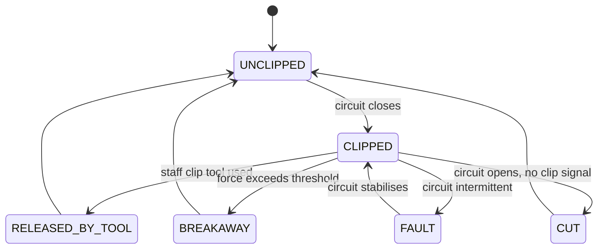
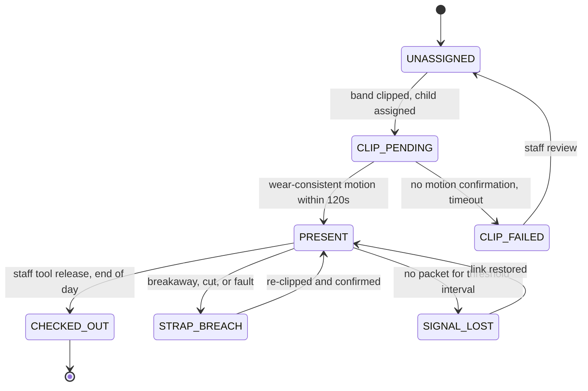

# LetGo Band, technical specification

How the system works. Scope, agent responsibilities, and the safety contract are
in `CLAUDE.md`. This file covers interfaces per tier, the hard constraints, the
two state machines, the failure path table, and the parameters that need
calibration before any deployment.

---

## 1. Inputs and outputs per tier

### Tier 0, the band

| | |
|---|---|
| **Inputs** | 6-axis IMU sample stream (accelerometer and gyroscope). Strap loop continuity on a GPIO pin. Clip tool signal. Battery state. Dock contact during provisioning and charging. |
| **Outputs** | Feature windows over BLE, one per `window_s`. Strap and clip events, sent out of band and unbatched. Battery and link telemetry. |
| **Local state** | Rolling raw sample buffer, current strap state, current clip state, sequence counter, unsent-window queue. |

The band computes features and discards raw samples on a rolling basis. It never
transmits raw samples.

### Tier 1, the edge gateway

| | |
|---|---|
| **Inputs** | Feature windows and strap events from every bonded band. Daily roster from the facility. Staff actions from the local console (acknowledge, dismiss, escalate, clip tool release attribution). |
| **Outputs** | Staff console alerts, ranked, local, sub-second. Attendance state transitions and reconciliation mismatches. Daily summary per child, pushed to the cloud. Append-only audit log entries. |
| **Local state** | Raw feature history per child for a facility-set retention window. Activity classifications. Attendance state per child. Open anomalies. Trend baselines. Store-and-forward queue for the cloud link. |

### Tier 2, the cloud

| | |
|---|---|
| **Inputs** | Daily summary payloads over mTLS, one per child per day, schema-validated at ingest. |
| **Outputs** | Parent portal views scoped to a single child. Multi-site administrative aggregates. |
| **Stored** | Daily summaries, attendance records, and resolved anomaly counts. Nothing else. |

---

## 2. Constraints, as hard rules

These are not preferences. An implementation that breaks one of them is not this
system.

1. **All agents execute on the edge gateway.** No agent, and no part of an
   agent, runs on the band or in the cloud.
2. **Raw IMU data never leaves the facility.** Raw samples do not leave the band.
   Extracted features do not leave the gateway. The cloud has no representation
   of a child's motion at any resolution finer than a daily total.
3. **No safety decision depends on the cloud.** Every escalation path terminates
   at the local staff console. The WAN link carries summaries and nothing that a
   carer needs in order to act.
4. **The band has no external buttons.** There is nothing a child can press.
   Provisioning and pairing happen in the contactless dock, never over the air.
5. **The strap circuit is the authority on wear.** No classifier output can
   assert that a band is worn when the circuit says open, and none can assert it
   is off when the circuit says closed.
6. **A strap breach is never suppressed.** Not by low confidence, not by
   attendance state, not by batching, not by an open alert of any other kind.
7. **Below the confidence floor, output is suppressed and logged.** The system
   fails to `unknown`. It does not fail to a best guess.
8. **The Safeguard has no override path.** See `CLAUDE.md` section 4.
9. **The cloud ingest endpoint rejects payloads containing disallowed fields.**
   Data minimisation is enforced by the schema validator, not by policy.
10. **Per-carer performance data is not generated.** There is no table to
    disable and no report to switch off, because the data does not exist.

---

## 3. The strap state machine

The strap loop is a conductive circuit running through the band, monitored on a
GPIO pin. Closed means worn. The clip tool signal is the second input, and the
two together separate four exit conditions that a single sensor would confuse.

| State | Meaning | Handling |
|---|---|---|
| `UNCLIPPED` | Circuit open, band not on a child | Normal. No child is assigned to this band. |
| `CLIPPED` | Circuit closed | Necessary for attendance, not sufficient. See section 4. |
| `RELEASED_BY_TOOL` | Circuit opened with a clip tool signal present | Expected removal. Logged and attributed to a staff badge. |
| `BREAKAWAY` | Mechanical separation at the calibrated force | Strap breach. Highest priority message class, bypasses batching. |
| `CUT` | Circuit opened with no clip tool signal and no breakaway | Strap breach. Highest priority message class, bypasses batching. |
| `FAULT` | Circuit intermittent | Strap breach class. Escalates as a device fault, not as a removal. |

`BREAKAWAY`, `CUT`, and `FAULT` are the strap breach class. They are sent
immediately on their own, ahead of any queued feature windows, and the Anomaly
Monitor may not suppress them.

Distinguishing `RELEASED_BY_TOOL` from `CUT` needs the clip tool signal to be
present at the moment the circuit opens. If the clip tool signal is absent or
ambiguous, the event is classified as `CUT`. The system errs towards escalation.

---

## 4. The attendance state machine

A band clipped around a chair leg or a bag strap also closes the circuit. Clip
state alone is therefore not attendance.

**Attendance requires two independent conditions:** circuit closed, plus
wear-consistent motion within a defined window.

| State | Entry condition | Who is told |
|---|---|---|
| `UNASSIGNED` | No child assigned to this band | Nobody |
| `CLIP_PENDING` | Circuit closed and a child assigned, motion not yet confirmed | Nobody, unless it times out |
| `PRESENT` | Circuit closed and wear-consistent motion inside `motion_confirmation_window` | Attendance record, staff console roster view |
| `CLIP_FAILED` | `motion_confirmation_window` elapsed with no wear-consistent motion | Staff, as a reconciliation mismatch |
| `STRAP_BREACH` | Any of `BREAKAWAY`, `CUT`, `FAULT` | Staff, immediately, highest priority |
| `SIGNAL_LOST` | No packet for `signal_loss_threshold` after check-in | Staff, graded by last known strap state |
| `CHECKED_OUT` | Clip tool release attributed to a staff badge at end of day | Attendance record, parent portal |

The Attendance Manager reconciles three independent sources: clip events, motion
confirmation, and the expected roster for the day. Its output is the set of
mismatches between those three, and it also drives the register entry.

Reconciliation mismatches it can raise:

| Mismatch | Meaning |
|---|---|
| Roster expects, no band | A child on today's roster has no band in `PRESENT` state. |
| Band present, not on roster | A band reports `PRESENT` for a child not expected today. |
| Clipped, never confirmed | `CLIP_FAILED`. Circuit closed on something that is not a moving child. |
| Present past expected pickup | `PRESENT` continues past the rostered end of day. |
| Checked out, still reporting | `CHECKED_OUT` band continues to send wear-consistent windows. |

---

## 5. Failure paths

| Condition | System behaviour |
|---|---|
| Gateway unreachable from band | Band buffers locally, continues strap monitoring, replays on reconnect |
| Internet down | Facility fully operational. Parent portal stale. No safety function lost. |
| Classifier confidence below floor | Safeguard suppresses. Logged, not surfaced. Never guessed. |
| Strap breach | Highest priority. Bypasses batching. Escalates immediately regardless of any other agent state. |
| Conflicting agent outputs | Safeguard precedence order applies. Safety outranks summary, always. |
| Band battery critical | Escalates to staff before depletion, not after |
| Signal loss after check-in | Anomaly Monitor escalates within a defined threshold interval, distinguishes radio dropout from removal using last known strap state |
| Gateway down | Bands buffer to local storage and keep monitoring the strap. Staff console unavailable, so the facility falls back to the paper register for the outage. Gateway runs on a UPS to make this rare. |
| Cloud ingest rejects a payload | Payload is quarantined on the gateway with the validator error, and retried after correction. Nothing is silently dropped. |
| Roster missing or stale | Attendance runs on clip plus motion alone and every child is raised as a "not on roster" mismatch, rather than the day failing. |
| Clip tool signal ambiguous at release | Event is classified `CUT` and escalates. The system errs towards escalation. |
| Two bands report the same `child_ref` | Both are flagged as a reconciliation mismatch. Neither is trusted for attendance until staff resolve it. |
| Band clock drift | Gateway timestamps on receipt and records the band-reported time separately. Sequence numbers order the windows. |

---

## 6. Parameters requiring calibration

These are parameters, not constants. Each needs empirical validation before
deployment, and each is configurable per facility unless noted.

| Parameter | Current working value | What it controls | How it gets settled |
|---|---|---|---|
| `breakaway_force_threshold` | Typically 20 to 30 N | Force at which the strap separates mechanically | Physical testing against child anthropometric data and playground snag scenarios. Must release before injury and must not release during normal play. Not user-configurable, it is set mechanically at manufacture. |
| `motion_confirmation_window` | 120 s | Time allowed between circuit close and wear-consistent motion before `CLIP_FAILED` | Pilot observation of real drop-off. Too short flags sleeping and carried children, too long delays the register. |
| `confidence_floor` | Not yet set | Classifier confidence below which the Safeguard suppresses output | Calibration against a staff-labelled validation set. Set from the false-positive rate a facility will tolerate on the staff console. |
| `signal_loss_threshold` | Not yet set | Time without a packet after check-in before `SIGNAL_LOST` escalates | Pilot measurement of normal BLE dropout duration in the facility, including dead spots and outdoor play areas. |
| `window_s` | 30 s | Feature window length | Trade-off between classification quality and radio duty cycle. Affects battery life. |
| `feature_retention_window` | Facility-set | How long extracted features are kept on the gateway | Facility policy and local data protection law. |

Two of these are unvalidated in a way that matters. `breakaway_force_threshold`
has no empirical basis in this design yet, only a typical range. `confidence_floor`
cannot be set at all until there is labelled child activity data, which does not
currently exist. See `OPEN-QUESTIONS.md`.

---

## 7. Interface contracts

Payload shapes, field-by-field, and the per-tier computation table are in
`docs/telemetry-schema.md`. The machine-readable version is
`schema/telemetry.schema.json`.

Two rules govern every message:

- Every band-to-gateway message carries a per-device HMAC. The gateway rejects
  any packet it cannot authenticate.
- Every gateway-to-cloud payload carries a monotonic sequence number and a
  timestamp per gateway, and the ingest endpoint rejects replays and any payload
  with a field outside the allowed set.
